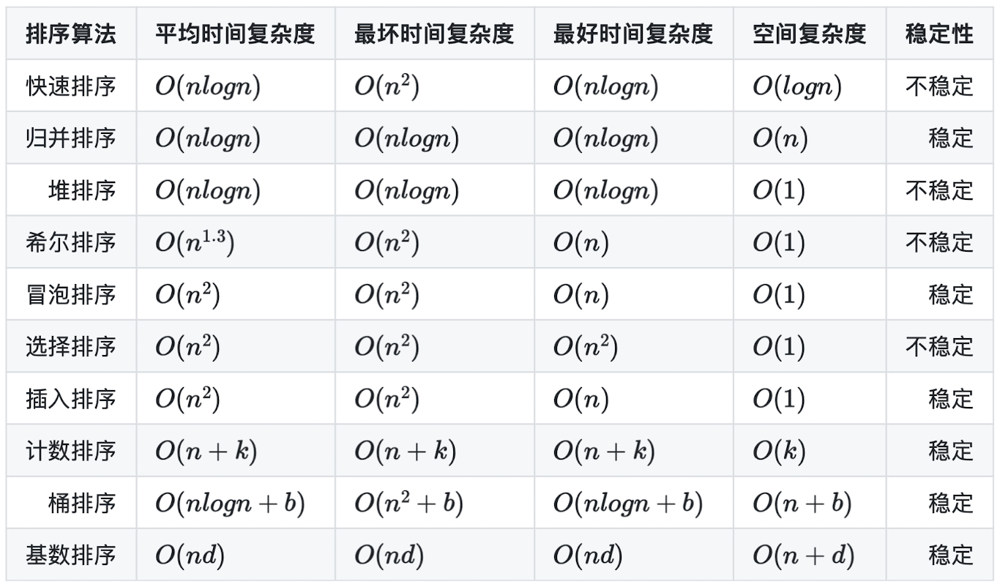

# 排序



- 重点排序：快速排序 (不稳定)，归并排序 (稳定)，堆排序 (不稳定)，希尔排序 (不稳定)
- 简单排序：冒泡排序 (稳定)，选择排序 (不稳定)，插入排序 (稳定)
- 有限数据范围，空间换时间：计数排序 (稳定)，桶排序 (稳定)，基数排序 (稳定)

## 快速排序

```ts
function partition(nums: number[], lo: number, hi: number): number {
  const randIdx = Math.floor(Math.random() * (hi - lo + 1)) + lo;
  [nums[lo], nums[randIdx]] = [nums[randIdx], nums[lo]];
  const pivot = nums[lo];
  while (lo < hi) {
    while (lo < hi && pivot <= nums[hi]) {
      --hi;
    }
    nums[lo] = nums[hi];
    while (lo < hi && nums[lo] <= pivot) {
      ++lo;
    }
    nums[hi] = nums[lo];
  }
  nums[lo] = pivot;
  return lo;
}

function quickSort(nums: number[], lo: number, hi: number) {
  if (lo >= hi) return;
  const mi = partition(nums, lo, hi);
  quickSort(nums, lo, mi - 1);
  quickSort(nums, mi + 1, hi);
}

function sortArray(nums: number[]): number[] {
  quickSort(nums, 0, nums.length - 1);
  return nums;
}
```

## 归并排序

```ts
function merge(nums: number[], lo: number, mi: number, hi: number) {
  const temp = new Array(hi - lo);
  let i = lo,
    j = mi,
    k = 0;
  while (i < mi && j < hi) {
    if (nums[i] <= nums[j]) {
      temp[k++] = nums[i++];
    } else {
      temp[k++] = nums[j++];
    }
  }
  while (i < mi) {
    temp[k++] = nums[i++];
  }
  while (j < hi) {
    temp[k++] = nums[j++];
  }
  for (i = lo, k = 0; i < hi; ++i, ++k) {
    nums[i] = temp[k];
  }
}

function mergeSort(nums: number[], lo: number, hi: number) {
  if (lo + 1 >= hi) return;
  const mi = Math.floor((lo + hi) / 2);
  mergeSort(nums, lo, mi);
  mergeSort(nums, mi, hi);
  merge(nums, lo, mi, hi);
}

function sortArray(nums: number[]): number[] {
  mergeSort(nums, 0, nums.length);
  return nums;
}
```

## 堆排序

```cpp
class Solution {
private:
    void siftDown(vector<int> &nums, int start, int end) {
        int parent = start;
        int child = parent * 2 + 1;
        while (child <= end) {
            if (child + 1 <= end && nums[child] < nums[child + 1])
                ++child;
            if (nums[parent] >= nums[child])
                return;
            swap(nums[parent], nums[child]);
            parent = child;
            child = parent * 2 + 1;
        }
    }

    void heapSort(vector<int> &nums) {
        int n = nums.size();
        for (int i = (n - 2) / 2; i >= 0; --i)
            siftDown(nums, i, n - 1);
        for (int i = n - 1; i >= 0; --i) {
            swap(nums[0], nums[i]);
            siftDown(nums, 0, i - 1);
        }
    }
public:
    vector<int> sortArray(vector<int>& nums) {
        heapSort(nums);
        return nums;
    }
};
```

## 希尔排序

```cpp
class Solution {
private:
    void shellSort(vector<int> &nums) {
        int n = nums.size();
        for (int gap = n / 2; gap >= 1; gap /= 2) {
            for (int i = 0; i < gap; ++i) {
                for (int j = i + gap; j < n; j += gap) {
                    int target = nums[j], k = j - gap;
                    while (k >= 0 && target < nums[k]) {
                        nums[k + gap] = nums[k];
                        k -= gap;
                    }
                    nums[k + gap] = target;
                }
            }
        }
    }
public:
    vector<int> sortArray(vector<int>& nums) {
        shellSort(nums);
        return nums;
    }
};
```

## 冒泡排序

```cpp
class Solution {
private:
    void bubbleSort(vector<int> &nums) {
        int n = nums.size();
        for (int i = n; i >= 2; --i) {
            bool noSwap = true;
            for (int j = 0; j < i - 1; ++j) {
                if (nums[j] > nums[j + 1]) {
                    swap(nums[j], nums[j + 1]);
                    noSwap = false;
                }
            }
            if (noSwap)
                break;
        }
    }
public:
    vector<int> sortArray(vector<int>& nums) {
        bubbleSort(nums);
        return nums;
    }
};
```

## 选择排序

```cpp
class Solution {
private:
    void selectionSort(vector<int> &nums) {
        int n = nums.size();
        for (int i = n; i >= 2; --i) {
            int maxIdx = 0;
            for (int j = 0; j < i; ++j)
                if (nums[j] > nums[maxIdx])
                    maxIdx = j;
            swap(nums[maxIdx], nums[i-1]);
        }
    }
public:
    vector<int> sortArray(vector<int>& nums) {
        selectionSort(nums);
        return nums;
    }
};
```

## 插入排序

```ts
function insertionSort(nums: number[]) {
  const n = nums.length;
  for (let i = 1; i < n; ++i) {
    const target = nums[i];
    let j = i - 1;
    while (j >= 0 && nums[j] > target) {
      nums[j + 1] = nums[j];
      --j;
    }
    nums[j + 1] = target;
  }
}

function sortArray(nums: number[]): number[] {
  insertionSort(nums);
  return nums;
}
```

## 计数排序

```cpp
class Solution {
private:
    void countingSort(vector<int> &nums, int minVal, int maxVal) {
        vector<short> count(maxVal - minVal + 1, 0);
        for (int &num : nums)
            count[num - minVal] += 1;
        int idx = 0;
        for (int i = minVal; i <= maxVal; ++i) {
            while (count[i - minVal] > 0) {
                nums[idx++] = i;
                count[i - minVal] -= 1;
            }
        }
    }
public:
    vector<int> sortArray(vector<int>& nums) {
        countingSort(nums, -50000, 50000);
        return nums;
    }
};
```

## 桶排序

```cpp
class Solution {
private:
    void bucketSort(vector<int> &nums, int minVal, int maxVal) {
        int n = nums.size();
        int bucketNum = (maxVal - minVal) / n + 1;
        vector<vector<int> > buckets(bucketNum, vector<int>());
        for (int &num : nums)
            buckets[(num - minVal) / n].push_back(num);
        int idx = 0;
        for (auto &bucket : buckets) {
            sort(bucket.begin(), bucket.end());
            for (int &num : bucket)
                nums[idx++] = num;
        }
    }
public:
    vector<int> sortArray(vector<int>& nums) {
        bucketSort(nums, -50000, 50000);
        return nums;
    }
};
```

## 基数排序

```cpp
class Solution {
private:
    void radixSort(vector<int> &nums, int minVal, int maxVal) {
        int newMaxVal = maxVal - minVal;
        int maxDigit = 0;
        while (newMaxVal) {
            maxDigit += 1;
            newMaxVal /= 10;
        }
        vector<vector<int> > buckets(10, vector<int>());
        int div = 1;
        for (int i = 0; i < maxDigit; ++i) {
            for (auto &bucket : buckets)
                bucket.clear();
            for (int &num : nums)
                buckets[(num - minVal) / div % 10].push_back(num);
            int idx = 0;
            for (auto &bucket : buckets)
                for (int &num : bucket)
                    nums[idx++] = num;
            div *= 10;
        }
    }
public:
    vector<int> sortArray(vector<int>& nums) {
        radixSort(nums, -50000, 50000);
        return nums;
    }
};
```
