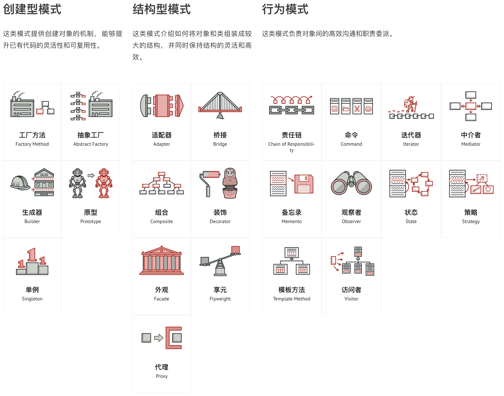

# 设计模式

共 23 种设计模式。

分为三类：

- 创建型：创建一个对象
  - 单例模式 (Singleton)
  - 原型模式 (Prototype)
- 结构型：将对象组合成更大的结构
  - 代理模式 (Proxy)
- 行为型：对象之间的通信和职责分工
  - 观察者模式 (Observer)
  - 迭代器模式 (Iterator)

## 浏览器中的设计模式

- 单例模式
  - 缓存、全局状态管理
- 观察者模式
  - 响应式数据

## JS 中的设计模式

- 原型模式
  - JS 创建对象的基本模式
- 代理模式
  - ES6 引入的 Proxy 类型、前端监控、网络代理
- 迭代器模式
  - ES6 引入的可迭代对象

## 创建型

- Factory Method
  - 工厂方法
- Abstract Factory
  - 抽象工厂
- Builder
- Prototype
  - 原型
- Singleton
  - 单例

## 结构型

- Adapter
  - 适配器
- Bridge
- Composite
  - 组合
- Decorator
  - 装饰器
- Facade
- Flyweight
- Proxy
  - 代理

## 行为型

- Chain of Responsibility
  - 责任链
- Command
  - 命令
- Iterator
  - 迭代器
- Mediator
- Memento
- Observer
  - 观察者
- State
- Strategy
  - 策略
- Template Method
  - 模板方法
- Visitor
