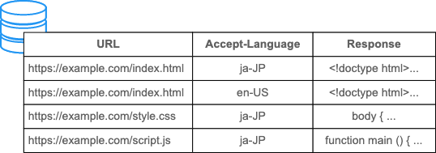

# 缓存

## Expires

HTTP/1.0 用 `Expires` 指定缓存过期的时间字符串。

```http
Expires: Wed, 21 Oct 2015 07:28:00 GMT
```

缺点：

- 基于客户端系统时间判断缓存的有效性，不够可靠
- 缓存过期后只能重新传输一份数据，对于数据没有改变的情况是多余的

## Cache-Control

HTTP/1.1 新增 `Cache-Control` 指定缓存策略。

| Request        | Response               |
| -------------- | ---------------------- |
| max-age        | max-age                |
| max-stale      |                        |
| min-fresh      |                        |
|                | s-maxage               |
| no-cache       | no-cache               |
| no-store       | no-store               |
| no-transform   | no-transform           |
| only-if-cached |                        |
|                | must-revalidate        |
|                | proxy-revalidate       |
|                | must-understand        |
|                | private                |
|                | public                 |
|                | immutable              |
|                | stale-while-revalidate |
| stale-if-error | stale-if-error         |

### Response

- `max-age=xxx`：缓存有效期，以秒为单位
  - 从资源产生时开始计算，浏览器存储时会减去 `Age`
  - 优先级高于 `Expires`
- `s-maxage=xxx`：类似 `max-age`，只用于共享缓存
  - 共享缓存 (shared)：在代理服务器、CDN 上存储
  - 优先级高于 `max-age`
- `no-cache`：允许缓存，但是每次请求都必须重新验证，无论缓存是否过期
- `must-revalidate`：当缓存过期时必须重新验证
  - 当无法连接服务器时，HTTP 默认允许使用过期的缓存，加上该指令可以禁止这种行为
- `proxy-revalidate`：类似 `must-revalidate`，只用于共享缓存
- `no-store`：禁止缓存
  - 禁止缓存新响应，但不禁止旧缓存的使用
- `private`：只能在浏览器缓存
- `public`：允许作为共享缓存
- `must-understand`：只有当理解基于状态码的缓存要求时才缓存资源
- `no-transform`：禁止修改资源
- `immutable`：缓存有效期内资源不会发生修改
- `stale-while-revalidate=xxx`：缓存过期后的一段时间内，允许使用过期的缓存，同时在后台重新验证
  - 减少响应时间，提升用户体验
- `stale-if-error`：缓存过期后重新验证时，如果遇到错误 (`500/502/503/504`)，在指定时间段内允许使用过期的缓存

### Request

- `no-cache`：强制重新验证，尽管缓存还没过期
  - 当用户强制刷新页面时，浏览器会带上这个指令
- `no-store`：避免缓存请求和响应
  - ⚠️ 大部分浏览器不支持
- `max-age=xxx`：允许使用缓存的有效期要求
  - 很多浏览器用 `max-age=0` 代替 `no-cache` 来刷新页面
- `max-stale=xxx`：允许使用过期一段时间的缓存
  - ⚠️ 大部分浏览器不支持
- `min-fresh=xxx`：禁止使用剩余有效期过短的缓存
  - ⚠️ 大部分浏览器不支持
- `no-transform`：与响应报文的指令含义相同
- `only-if-cached`：只返回缓存，即使已经过期，如果没有缓存返回 504

## Vary

- 缓存默认通过 URL 区分，相同的 URL 会返回相同的缓存，但有一些例外
- 通过 `Accept`、`Accept-Language`、`Accept-Encoding` 进行内容协商，不同的请求头会返回不同的内容，应该分开缓存
- 可以在 `Vary` 中指定缓存的 key，比如：

```
Vary: Accept-Language
```

缓存查找时就会同时考虑 URL 和 `Accept-Language` 的值：



## Last-Modified

资源的最后修改时间。

```http
Last-Modified: <day-name>, <day> <month> <year> <hour>:<minute>:<second> GMT
Last-Modified: Wed, 21 Oct 2015 07:28:00 GMT
```

过期缓存重新验证时，发送包含 `If-Modified-Since` 的报文，值为缓存的生成时间。

```http
If-Modified-Since: <day-name>, <day> <month> <year> <hour>:<minute>:<second> GMT
```

`Last-Modified` 也用于爬虫、CMS 等应用。

缺点：

- 部分文件会周期性修改，但是内容不一定变化，会造成缓存不必要的失效
- 部分文件修改非常频繁，以秒为粒度的 `Last-Modified` 无法准确描述
- 一些文件系统无法精确得到文件的修改时间，可能影响缓存的准确性

## ETag

- 服务端生成、区分资源是否修改的字符串，比如哈希值、版本号等
- 优先级高于 `Last-Modified`

```http
ETag: W/"<etag_value>"
ETag: "<etag_value>"
```

- 缓存过期重新验证时，把 `ETag` 的值放入 `If-None-Match`，请求服务端资源是否被修改
- 优先级高于 `If-Modified-Since`

```http
If-None-Match: "<etag_value>"
If-None-Match: "<etag_value>", "<etag_value>", …
If-None-Match: *
```

## 强缓存

本地缓存命中且未过期，直接使用本地缓存的资源。

## 协商缓存

1. 缓存过期，带上 `If-Modified-Since` 或 `If-None-Match` 请求服务端
2. 资源未修改，返回 `304 Not Modified`，重新设置缓存有效时间，使用本地缓存
3. 资源已修改，返回 `200 OK` 和资源的最新版本
   - 服务端 `Last-Modified` 晚于 `If-Modified-Since`
   - 服务端 `ETag` 与 `If-None-Match` 不同

## 优点

- 减少响应时间
- 降低服务器负载
- 节省带宽
