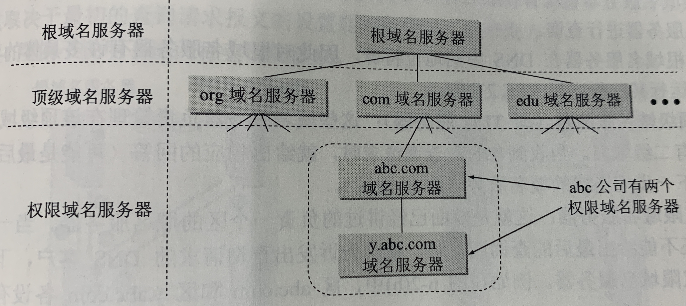
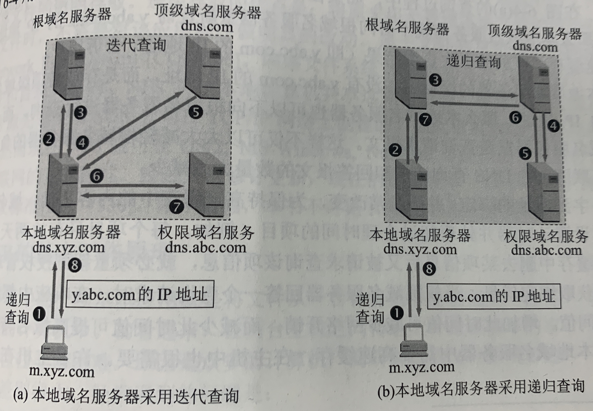
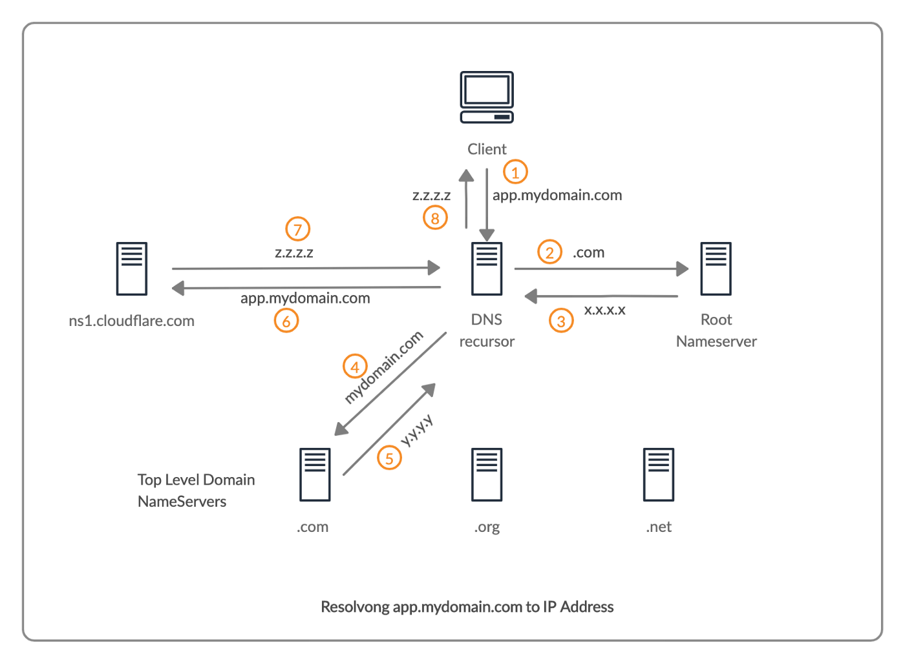

# DNS

DNS (Domain Name System) 是将域名转换为 IP 地址的分布式数据库。

## 域名

域名可以分为：根域名 (`.`)、顶级域名、二级域名等。

比如 mail.buaa.edu.cn 就是一个域名 (Domain Name)，由 4 个域 (Domain) 组成，每个域都有一个标号 (Label)，分别是：

- 顶级域名 com
- 二级域名 edu
- 三级域名 buaa
- 四级域名 mail

每一个 Label 不超过 63 个字符，只能由字母、数字、连字符组成，字母不区分大小写，完整域名不超过 255 个字符。

各级域名由上一级的域名管理机构管理，顶级域名由 ICANN 管理。

顶级域名 TLD (Top Level Domain) 分为 4 类：

- 国家顶级域名 nTLD/ccTLD
  - cn, us, uk ...
- 通用顶级域名 gTLD
  - com, net, org, edu, gov ...
- 基础结构域名 (infrastructure domain)
  - arpa
- 新顶级域名 New gTLD
  - 商城, 公司, 新闻 ...

中国把二级域名分为 2 类：

- 类别域名：ac, com, edu, gov, mil, net, org (7 个)
- 行政区域名：bj, js ... (34 个)

## 域名服务器

主机通过请求域名服务器 (name server) 来获取对应的 IP 地址，域名服务器分为 4 类：

- 根域名服务器 (root name server)
- 顶级域名服务器 (TLD server)
- 权限域名服务器 (authoritative name server)
  - 以区 (zone) 为单位
- 本地域名服务器 (local name server)
  - ISP/大学/系，不超过几个路由器的距离

由于域名到 IP 地址的映射不经常变化，可以在主机和域名服务器上设置高速缓存 (cache)，存储最近查询过的域名和 IP 信息。

## 解析过程

域名解析过程：

1. 查询主机缓存。
2. 递归查询本地域名服务器。
3. 迭代查询根域名服务器。
4. 迭代查询顶级域名服务器。
5. 迭代查询权限域名服务器。
6. 得到 IP 地址并返回。

如果之前查询过的服务器缓存中有当前需要查询服务器的 IP，则可以跳过相应服务器的查询。

比如本地域名服务器缓存中没有完整域名的 IP，但是有顶级域名服务器的 IP，则无需查询根域名服务器，可以直接查询顶级域名服务器。

## 传输

DNS 可以使用 UDP 和 TCP 传输，大部分情况下使用 UDP。

以下情况会使用 TCP：

- 返回的响应超过 512 字节
- 区域传送：主域名服务器向辅助域名服务器传送变化的数据
