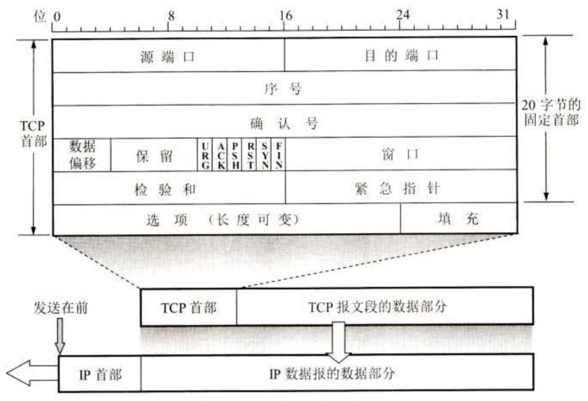
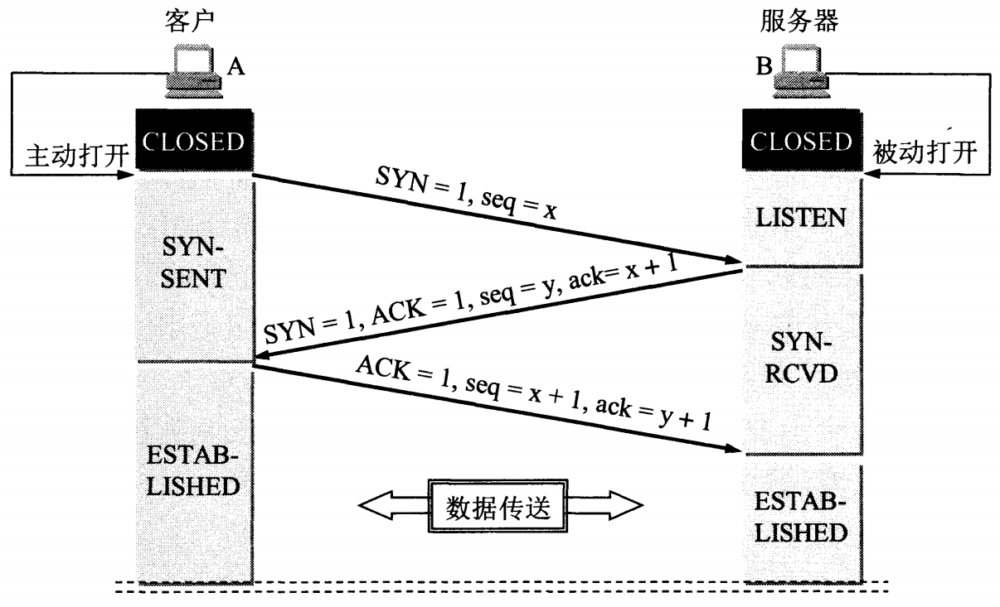
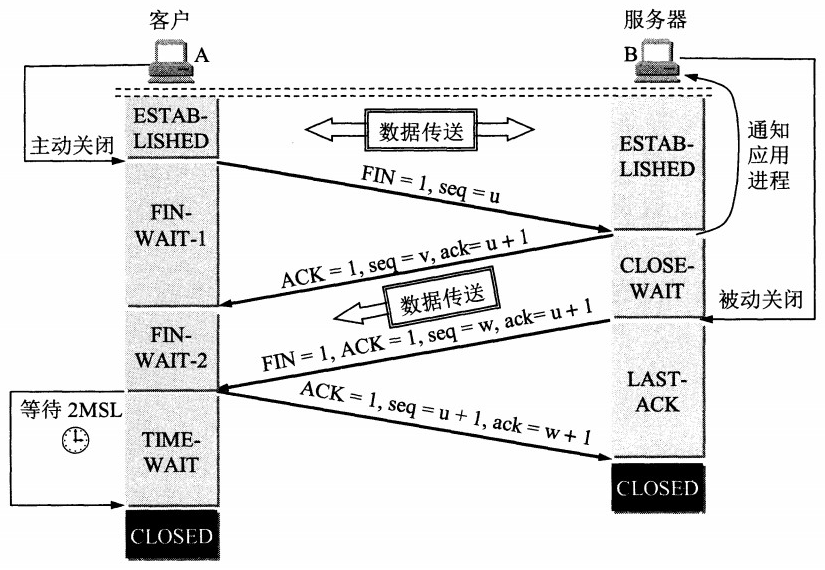
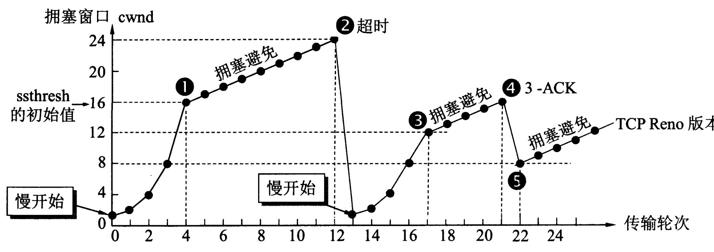

# TCP

## 报文格式

## 连接建立

1. 客户端、服务端都处于 CLOSED 状态
2. 服务端启动后进入 LISTEN 状态，监听客户端请求
3. 客户端需要建立连接时，发送请求报文
   - SYN 置 1
   - 起始序号为 x
   - 然后进入 SYN-SENT 状态（SYN 报文已发送）
4. 服务端接收到请求报文，发回响应报文
   - SYN 置 1
   - 起始序号为 y
   - ACK 置 1
   - ack 为 x + 1
   - 然后进入 SYN-RCVD 状态（SYN 报文已收到）
5. 客户端接收到响应报文，发回确认报文
   - 序号为 x + 1
   - ACK 置 1
   - ack 为 y + 1
   - 然后进入 ESTABLISHED 状态（连接建立）
6. 服务端接收到确认报文，也进入 ESTABLISHED 状态（连接建立）

注意点：

- 只有前两个报文 SYN 置 1
- 客户端和服务端的序号相互独立
- 第二个报文开始 ACK 都置 1、ack 为上一个收到报文的序号 + 1

**Q：** 为什么需要第三次握手，而不是两次？

**A：** 防止滞留的连接请求到达服务端，造成服务端错误地打开连接。

- 比如客户端发送的第 1 个连接请求报文滞留在网络中但没有丢失，客户端未收到响应一段时间后超时重传，最终完成三次握手建立连接，但是滞留的请求报文最终到达了服务端
- 如果只有两次握手，服务端收到请求就会打开连接，可能打开不需要的连接，造成资源浪费
- 如果需要三次握手，尽管服务器收到了滞留的请求报文，并发回确认报文，但由于此时客户端不需要建立连接，不会发回第 3 个确认报文，TCP 连接就无法建立

## 连接释放

1. 客户端和服务端都处于 ESTABLISHED 状态
2. 客户端需要关闭连接时，发送请求报文
   - FIN 置 1
   - 起始序号为 u
   - 然后进入 FIN-WAIT-1 状态（等待服务端的响应报文）
3. 服务端接收到请求报文，发回响应报文
   - 起始序号为 v
   - ACK 置 1
   - ack 为 u + 1
   - 然后进入 CLOSE-WAIT 状态（等待服务端关闭到客户端的连接）
4. 客户端接收到响应报文，进入 FIN-WAIT-2 状态（等待服务端的关闭请求报文）
   - 客户端到服务端的单向连接已关闭，但服务端还可以继续向客户端发送数据
5. 服务端完成最后的数据传输，发送关闭请求报文
   - FIN 置 1
   - 起始序号为 w
   - ACK 置 1
   - ack 为 u + 1
   - 然后进入 LAST-ACK 状态（等待最后一个响应报文）
6. 客户端接收到请求报文，发回响应报文
   - 序号为 u + 1
   - ACK 置 1
   - ack 为 w + 1
   - 然后进入 TIME-WAIT 状态（等待 2MSL 时间）
7. 服务端接收到响应报文，直接进入 CLOSED 状态
8. 客户端等待 2MSL 时间后自动进入 CLOSED 状态
   - MSL：Maximum Segment Lifetime，最大报文存活时间

注意点：

- 只有关闭请求报文 FIN 置 1
- 客户端和服务端的序号相互独立
- 第二个报文开始 ACK 都置 1、ack 为上一个收到报文的序号 + 1
- 客户端第一个报文和第四个报文的序号相邻，因为中间没有其他报文
- 服务端第二个报文和第三个报文的序号不一定相邻，因为中间可能进行数据传输

**Q：** 为什么客户端发送第四个响应报文后，需要等待 2MSL 的时间？

**A：** 原因有 2 个：

1. 确保第四个确认报文能够到达服务端
   - 如果服务端没收到客户端发送来的确认报文，就会超时重传第三个请求报文
   - 客户端等待一段时间就是为了处理这种情况，等待期间如果收到重传的请求报文就可以重新发送确认报文
   - 如果不等待而直接关闭，就会造成服务端收不到第四个响应报文而无法关闭连接
2. 让本连接期间的所有报文都从网络中消失，使下一个连接不会出现旧的报文

如果客户端关闭连接后，服务端没有数据要发送，可以把第二个和第三个报文合并，也就是变为 “三次挥手” 而不是 “四次挥手”。

## 可靠传输

可靠传输的核心是**超时重传**：已发送的报文在指定时间内没有收到确认，就重新发送。

超时重传时间称为 RTO (Retransmission TimeOut)：

> RTO = RTTs + 4 \* RTTd

RTTs 是加权平均往返时间，根据每次通信的 RTT 实时更新：

> RTTs = (1 - a) \* RTTs + a \* RTT

- 初始 RTTs 值为 RTT
- a 是范围 [0, 1) 的参数，a 越大，最新的 RTT 对 RTTs 的影响就越大，推荐值是 1/8

RTTd 是 RTTs 与 RTT 偏差的加权平均值：

> RTTd = (1 - b) \* RTTd + b \* |RTTs - RTT|

- 初始 RTTd 值为 RTT 的一半
- b 是范围 [0, 1) 的参数，b 越大，最新的偏差对 RTTd 的影响就越大，推荐值是 1/4

Karn 算法：

- 发生超时重传，说明网络发生了拥塞，应该把 RTO 的值增大一点，避免更多的超时重传，通常增大为原来的 2 倍
- 直到不再发生超时重传，继续使用上面的公式计算 RTO

## 流量控制

控制发送方的发送速率，使接收方来得及接收 (接收缓存不会溢出)。

流量控制通过确认报文的窗口字段实现 (接收窗口)，发送窗口的大小不能超过接收窗口。

## 拥塞控制

TCP 通过 4 个算法进行拥塞控制：慢开始、拥塞避免、快重传、快恢复。

### 慢开始

- 初始 cwnd = 1，每收到一个确认将 cwnd + 1，每个轮次 cwnd 变为原来的两倍，呈指数增长
- 设置慢开始门限 ssthresh，当 cwnd >= ssthresh 时，转为执行拥塞避免算法

### 拥塞避免

- 每个轮次将 cwnd + 1，呈线性增长
- 如果发生超时，说明网络发生了拥塞，将 ssthresh 设为 cwnd / 2，cwnd 设为 1，重新开始执行慢开始算法

### 快重传

- 每收到一个报文，就对目前按序收到的最后一个报文发回确认
- 如果发送方连续收到 3 个对同一报文的确认 (3-ACK)，说明该报文的下一个报文已经丢失，立即重传下一个报文，而不是等到超时再重传

### 快恢复

- 发生快重传，只是部分报文丢失，不一定是网络拥塞，将 ssthresh 设为 cwnd / 2，cwnd 设为 ssthresh，执行拥塞避免算法
