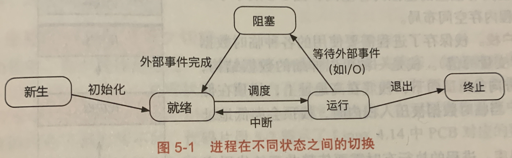
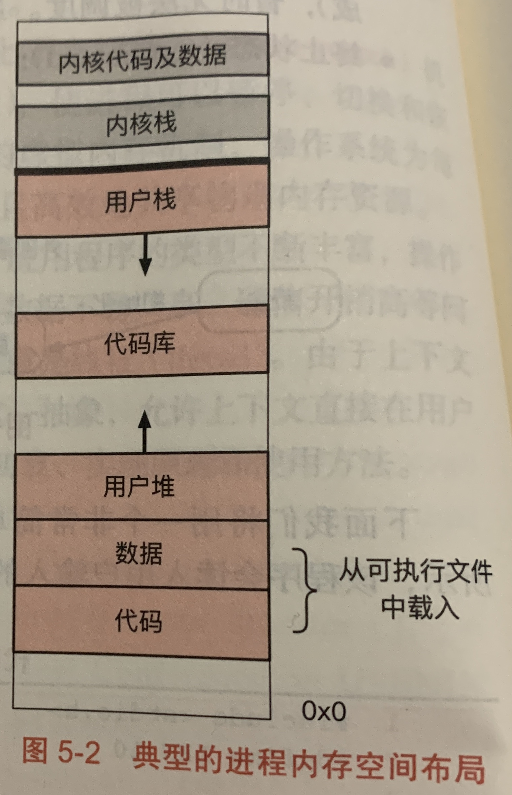

# 进程和线程

## 进程 (process)

- 进程是资源分配的基本单位。
- 一个进程可以包含多个线程，这些线程共享资源。
- 进程切换需要保存和设置上下文，开销较大。
- 进程的创建和销毁需要分配或回收资源，开销较大。
- 进程通信需要使用 IPC，包括管道、消息队列、信号量、共享内存、socket。

### 进程状态

- 新生 (new)：刚被创建出来，还未完成初始化，不能被调度
- 就绪 (ready)：可以被调度，但还未被调度器选择
- 运行 (running)：就绪的进程被调度器选择后进入运行状态，运行一段时间后，可以中断其执行转换回就绪状态，如果需要等待某个外部事件则进入阻塞状态，运行结束进入终止状态
- 阻塞 (blocked)：进程正在等待某个外部事件 (比如 I/O 请求)，外部事件完成后进入就绪状态
- 终止 (terminated)：进程执行结束

### 虚拟地址空间

每个进程拥有独立的虚拟内存空间。

- 内核部分：
  - 位于内核地址空间最顶端，每个进程都映射了相同的内核部分
  - 用户态时内核部分不可见，进入内核态后才能访问
  - 由于中断或系统调用进入内核态后，会使用内核栈
- 用户栈：保存用户态的临时数据，比如函数调用的栈帧，从高地址向低地址扩展
- 代码库：进程有时需要调用共享库 (比如 libc)，这些共享库会被映射到用户栈下方，并被标记为只读
- 用户堆：保存动态分配的数据，从低地址向高地址扩展
- 数据与代码段：从可执行文件中加载而来，数据段主要保存全局变量
- 在用户栈和用户堆之间还会映射一些与系统调用相关的区域、用于缓存和共享内存的匿名区域
- 查看虚拟地址空间分布：`cat /proc/<PID>/maps`

### PCB

进程上下文通常称为 PCB (Process Control Block)，主要包括：

- 当前运行的状态
- 进程号 pid
- 父进程号 ppid
- 打开的文件描述符
- 信号 signal

## 线程 (thread)

- 线程是调度的基本单位。
- 线程切换只需要保存和设置少量寄存器，开销更小。
- 线程的创建和销毁开销更小。
- 线程通信可以通过读写同一进程的数据实现，更方便。
- 线程同步的方法包括互斥锁、条件变量、信号量、共享内存。
