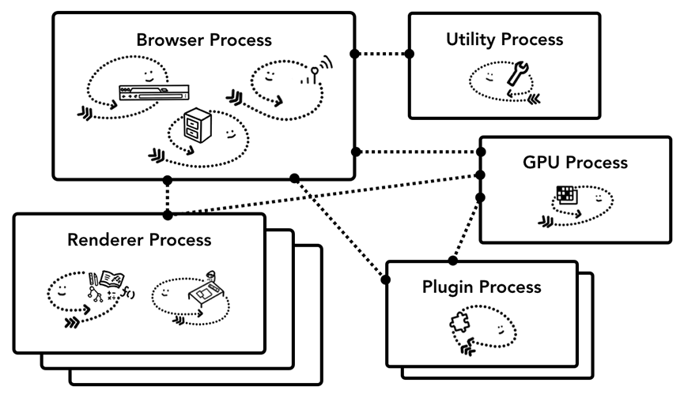
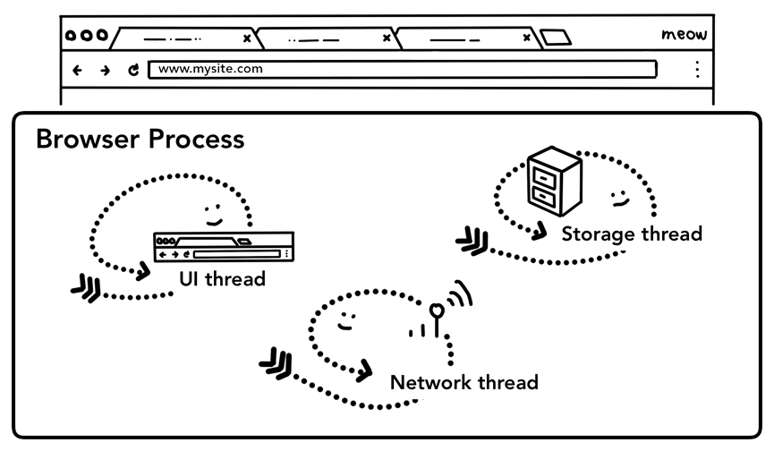
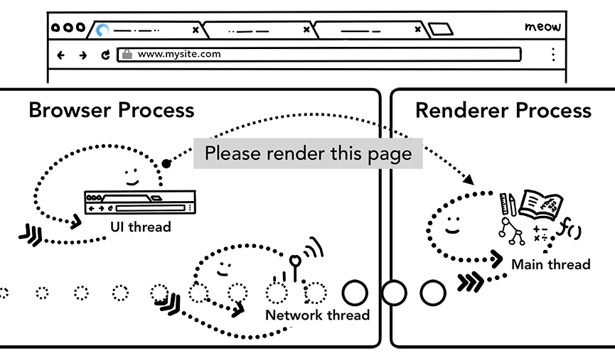
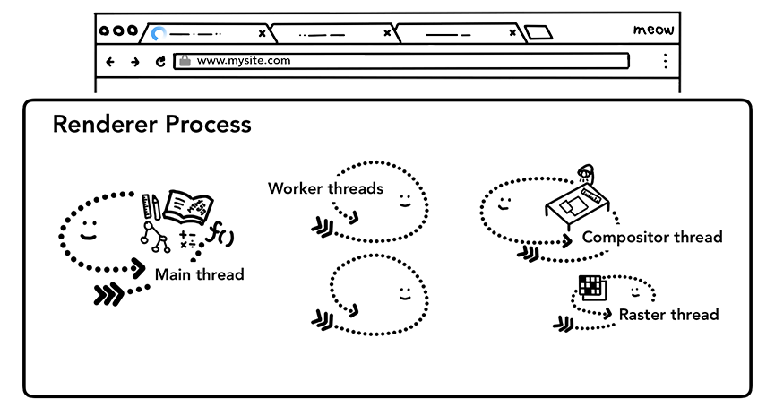
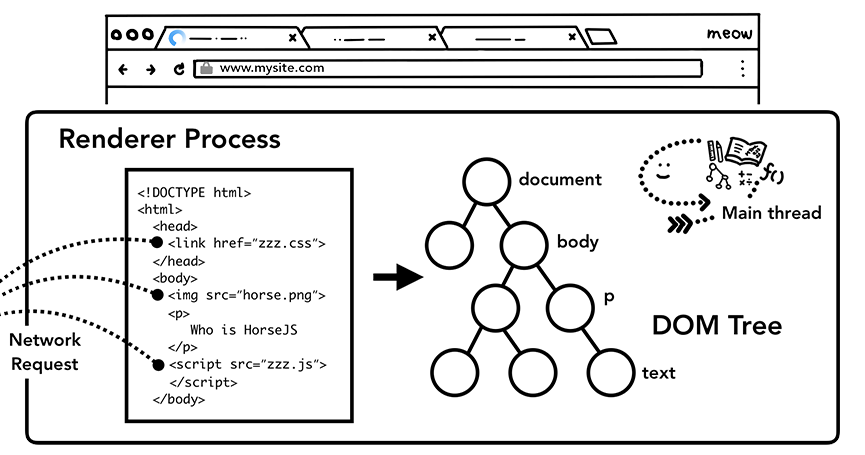
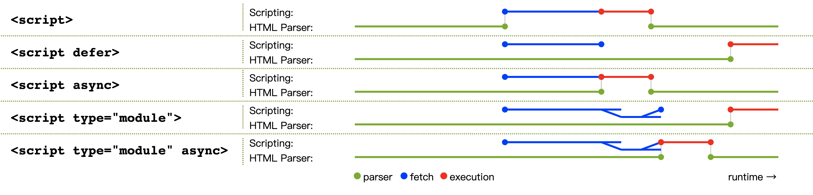
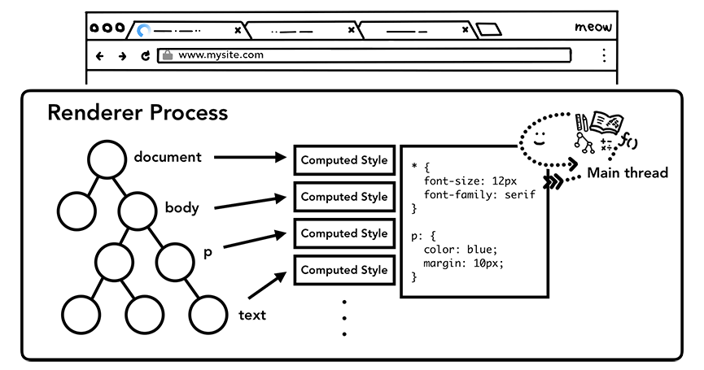
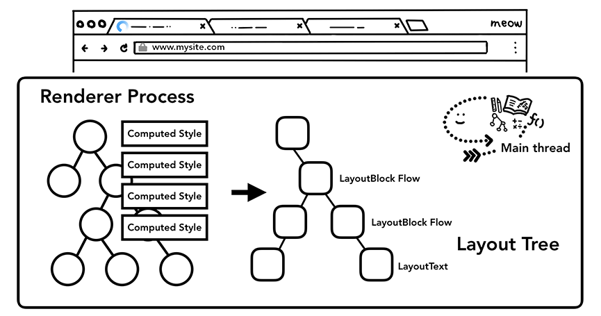
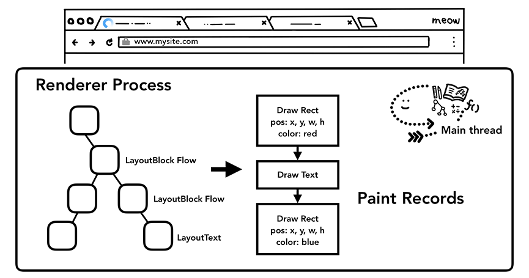
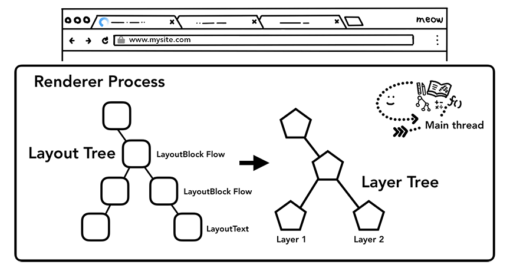

# 输入 URL 后发生了什么

## Chrome 架构

有 5 种进程：
- 浏览器进程 (browser)
- 渲染器进程 (renderer)
- GPU 进程
- 实用工具进程 (utility)
- 插件进程 (plugin)

## 导航

浏览器进程 (browser process) 包含以下 3 种线程：

1. 在浏览器的地址栏输入 URL，按下回车
2. **UI 线程**判断输入的是 URL 还是搜索字符串
   - 如果是搜索字符串，改写为搜索引擎的 URL
   - 比如 `https://www.google.com/search?q=keyword`
3. 如果没有协议名，**UI 线程**默认补充为 `http://`，然后通知**网络线程**发起请求
   - 如果请求失败还会尝试 `https://`
4. 如果主机名是域名，**网络线程**进行 DNS 查询获取 IP 地址
5. **网络线程**向该 IP 地址的服务器发送 HTTP 请求报文
6. 服务器上的 Web Server (nginx、Apache 等) 根据配置文件和请求的 URL，定位静态文件或将请求转发给其他进程 (Node、Java 等)，得到 HTTP 响应报文并发回给浏览器
7. 如果服务器要求重定向 (301)，**网络线程**通知 **UI 线程**将进行重定向，然后发起对另一个 URL 的请求
8. **网络线程**接收到响应报文后，检查是否存在 `Content-Type` 头部，否则进行 MIME 嗅探
9.  如果响应类型是 `HTML`，将会把数据交给**渲染器进程**，如果是其他类型文件，意味着是一个下载请求，把数据交给**下载管理器**
10. 如果 URL 和响应报文匹配已知的**恶意网站**，**网络线程**会显示警告页面 ⚠️
11. **网络线程**进行 CORB (Cross Origin Read Blocking) 检查，避免非法跨站请求数据被渲染
12. 安全检查通过后，**网络线程**通知 **UI 线程**数据接收完毕，**UI 线程**通知**渲染器进程**开始渲染页面，并通过**网络线程**向**渲染器进程**传输数据
13. **浏览器进程**收到**渲染器进程**的确认后，导航阶段 (Navigation) 完成，浏览器地址栏的 UI 更新，**渲染器进程**负责加载资源和渲染页面

## 渲染

渲染器进程 (renderer process) 包含以下 4 种线程：

1. **主线程**解析 HTML 字符串，转换为 DOM
   
2. 解析时并发运行 “预加载扫描器”，发现 ``、`<link>` 等外部资源后，提交给**网络线程**发起请求
3. `<script>` 资源比较特殊，有多种加载模式，默认会暂停解析 HTML 并请求、执行 JS 脚本
   
4. **主线程**解析 CSS 并得到计算样式 (computed)
   
5. **主线程**遍历 DOM 树和计算样式，构造一棵**布局树** (Layout Tree)
   - 每个节点有坐标和尺寸信息
   - 只包含可见元素的信息，不包括 `display: none` 的元素
   
6. **主线程**遍历布局树，构造**绘制记录**，从而明确绘制顺序，正确处理 `z-index` 等问题
   
7. **主线程**遍历布局树，构造**分层树** (Layer Tree)，实现页面的分层
   
8. 每一帧使用**合成器线程**把层转换为像素，保存在显存中
9.  创建好的**合成器帧**通过 IPC 发给**浏览器进程**，然后转发给 GPU 进程
