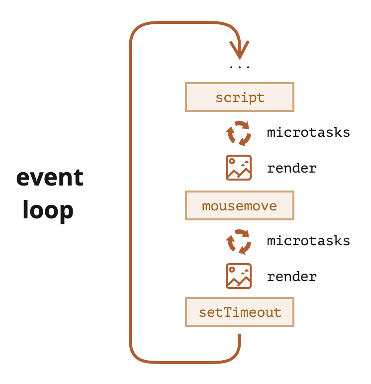

# 事件循环

浏览器和 Node 中 JS 的执行都遵循**事件循环 (event loop)** 的模式。

宏任务 (Macrotask)：
- 执行脚本文件代码 (`<script>`)
- 事件处理程序
- `setTimeout(f)`

微任务 (Microtask)：
- Promise 的 `then/catch/finally` 处理程序
- `queueMicrotask(f)`

基本的事件循环算法：
1. 执行宏任务队列队头的第一个宏任务
2. 执行所有微任务
3. 渲染 DOM 变更
4. 如果宏任务队列为空，则休眠直到出现下一个宏任务
5. 转到步骤 1

Web Workers：
- 适用于不应该阻塞事件循环的耗时长的计算任务
- 在另一个**并行**线程中运行代码
- 具有自己的变量和事件循环，可以与主线程交换消息
- 没有访问 DOM 的权限
- 适用于多核计算
