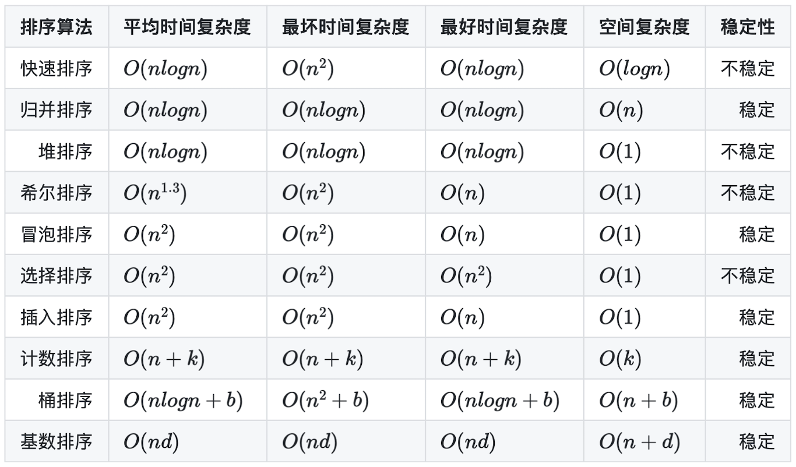

# 排序



- 重点排序：快速排序 (不稳定)，归并排序 (稳定)，堆排序 (不稳定)，希尔排序 (不稳定)
- 简单排序：冒泡排序 (稳定)，选择排序 (不稳定)，插入排序 (稳定)
- 有限数据范围，空间换时间：计数排序 (稳定)，桶排序 (稳定)，基数排序 (稳定)

## 快速排序

```ts
function partition(nums: number[], lo: number, hi: number): number {
  const randIdx = Math.floor(Math.random() * (hi - lo + 1)) + lo;
  [nums[lo], nums[randIdx]] = [nums[randIdx], nums[lo]];
  const pivot = nums[lo];
  while (lo < hi) {
    while (lo < hi && pivot <= nums[hi]) {
      --hi;
    }
    nums[lo] = nums[hi];
    while (lo < hi && nums[lo] <= pivot) {
      ++lo;
    }
    nums[hi] = nums[lo];
  }
  nums[lo] = pivot;
  return lo;
}

function quickSort(nums: number[], lo: number, hi: number) {
  if (lo >= hi) {
    return;
  }
  const mi = partition(nums, lo, hi);
  quickSort(nums, lo, mi - 1);
  quickSort(nums, mi + 1, hi);
}

function sortArray(nums: number[]): number[] {
  quickSort(nums, 0, nums.length - 1);
  return nums;
}
```

## 归并排序

```ts
function merge(nums: number[], lo: number, mi: number, hi: number) {
  const temp = new Array(hi - lo);
  let i = lo;
  let j = mi;
  let k = 0;
  while (i < mi && j < hi) {
    if (nums[i] <= nums[j]) {
      temp[k++] = nums[i++];
    } else {
      temp[k++] = nums[j++];
    }
  }
  while (i < mi) {
    temp[k++] = nums[i++];
  }
  while (j < hi) {
    temp[k++] = nums[j++];
  }
  for (i = lo, k = 0; i < hi; ++i, ++k) {
    nums[i] = temp[k];
  }
}

function mergeSort(nums: number[], lo: number, hi: number) {
  if (lo + 1 >= hi) {
    return;
  }
  const mi = Math.floor((lo + hi) / 2);
  mergeSort(nums, lo, mi);
  mergeSort(nums, mi, hi);
  merge(nums, lo, mi, hi);
}

function sortArray(nums: number[]): number[] {
  mergeSort(nums, 0, nums.length);
  return nums;
}
```

## 堆排序

```ts
function siftDown(nums: number[], lo: number, hi: number) {
  let parent = lo;
  let child = parent * 2 + 1;
  while (child <= hi) {
    if (child + 1 <= hi && nums[child] < nums[child + 1]) {
      ++child;
    }
    if (nums[parent] >= nums[child]) {
      return;
    }
    [nums[parent], nums[child]] = [nums[child], nums[parent]];
    parent = child;
    child = parent * 2 + 1;
  }
}

function heapSort(nums: number[]) {
  const n = nums.length;
  for (let i = Math.floor((n - 2) / 2); i >= 0; --i) {
    siftDown(nums, i, n - 1);
  }
  for (let i = n - 1; i >= 0; --i) {
    [nums[0], nums[i]] = [nums[i], nums[0]];
    siftDown(nums, 0, i - 1);
  }
}

function sortArray(nums: number[]): number[] {
  heapSort(nums);
  return nums;
}
```

## 希尔排序

```ts
function shellSort(nums: number[]) {
  const n = nums.length;
  for (let gap = Math.floor(n / 2); gap >= 1; gap = Math.floor(gap / 2)) {
    for (let i = 0; i < gap; ++i) {
      for (let j = i + gap; j < n; j += gap) {
        const target = nums[j];
        let k = j - gap;
        while (k >= 0 && target < nums[k]) {
          nums[k + gap] = nums[k];
          k -= gap;
        }
        nums[k + gap] = target;
      }
    }
  }
}

function sortArray(nums: number[]): number[] {
  shellSort(nums);
  return nums;
}
```

## 冒泡排序

```ts
function bubbleSort(nums: number[]) {
  const n = nums.length;
  for (let i = n; i >= 2; --i) {
    let noSwap = true;
    for (let j = 0; j < i - 1; ++j) {
      if (nums[j] > nums[j + 1]) {
        [nums[j], nums[j + 1]] = [nums[j + 1], nums[j]];
        noSwap = false;
      }
    }
    if (noSwap) {
      break;
    }
  }
}

function sortArray(nums: number[]): number[] {
  bubbleSort(nums);
  return nums;
}
```

## 选择排序

```ts
function selectionSort(nums: number[]) {
  const n = nums.length;
  for (let i = n; i >= 2; --i) {
    let maxIdx = 0;
    for (let j = 0; j < i; ++j) {
      if (nums[j] > nums[maxIdx]) {
        maxIdx = j;
      }
    }
    [nums[maxIdx], nums[i - 1]] = [nums[i - 1], nums[maxIdx]];
  }
}

function sortArray(nums: number[]): number[] {
  selectionSort(nums);
  return nums;
}
```

## 插入排序

```ts
function insertionSort(nums: number[]) {
  const n = nums.length;
  for (let i = 1; i < n; ++i) {
    const target = nums[i];
    let j = i - 1;
    while (j >= 0 && nums[j] > target) {
      nums[j + 1] = nums[j];
      --j;
    }
    nums[j + 1] = target;
  }
}

function sortArray(nums: number[]): number[] {
  insertionSort(nums);
  return nums;
}
```

## 计数排序

```ts
function countingSort(nums: number[], minVal: number, maxVal: number) {
  const count: number[] = new Array(maxVal - minVal + 1).fill(0);
  for (const num of nums) {
    count[num - minVal] += 1;
  }
  let idx = 0;
  for (let i = minVal; i <= maxVal; ++i) {
    while (count[i - minVal] > 0) {
      nums[idx++] = i;
      count[i - minVal] -= 1;
    }
  }
}

function sortArray(nums: number[]): number[] {
  countingSort(nums, -50000, 50000);
  return nums;
}
```

## 桶排序

```ts
function bucketSort(nums: number[], minVal: number, maxVal: number) {
  const n = nums.length;
  const bucketNum = Math.floor((maxVal - minVal) / n) + 1;
  const buckets: number[][] = new Array(bucketNum).fill(0).map(() => []);
  for (const num of nums) {
    buckets[Math.floor((num - minVal) / n)].push(num);
  }
  let idx = 0;
  for (const bucket of buckets) {
    bucket.sort((a, b) => a - b);
    for (const num of bucket) {
      nums[idx++] = num;
    }
  }
}

function sortArray(nums: number[]): number[] {
  bucketSort(nums, -50000, 50000);
  return nums;
}
```

## 基数排序

```ts
function radixSort(nums: number[], minVal: number, maxVal: number) {
  let newMaxVal = maxVal - minVal;
  let maxDigit = 0;
  while (newMaxVal) {
    maxDigit += 1;
    newMaxVal = Math.floor(newMaxVal / 10);
  }
  const buckets: number[][] = new Array(10);
  let div = 1;
  for (let i = 0; i < maxDigit; ++i) {
    for (let j = 0; j < 10; ++j) {
      buckets[j] = [];
    }
    for (const num of nums) {
      buckets[Math.floor((num - minVal) / div) % 10].push(num);
    }
    let idx = 0;
    for (const bucket of buckets) {
      for (const num of bucket) {
        nums[idx++] = num;
      }
    }
    div *= 10;
  }
}

function sortArray(nums: number[]): number[] {
  radixSort(nums, -50000, 50000);
  return nums;
}
```
