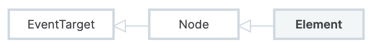

# DOM 转对象

```js
function domToObject(element) {
  const vnode = {
    tag: element.nodeName,
    children: [],
  };
  for (const node of element.childNodes) {
    vnode.children.push(domToObject(node));
  }
  return vnode;
}
```


