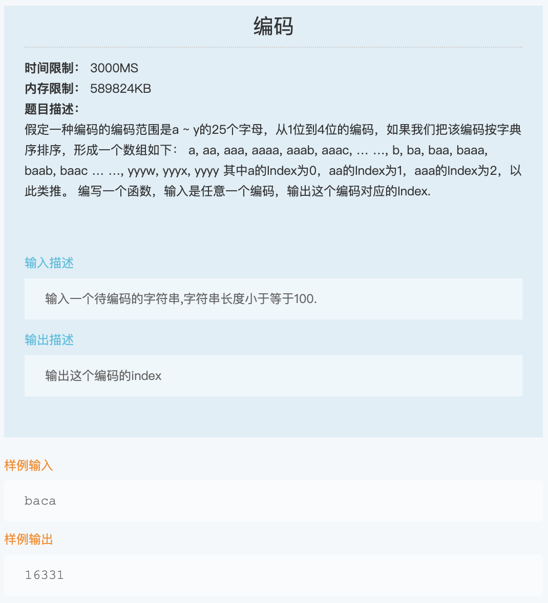
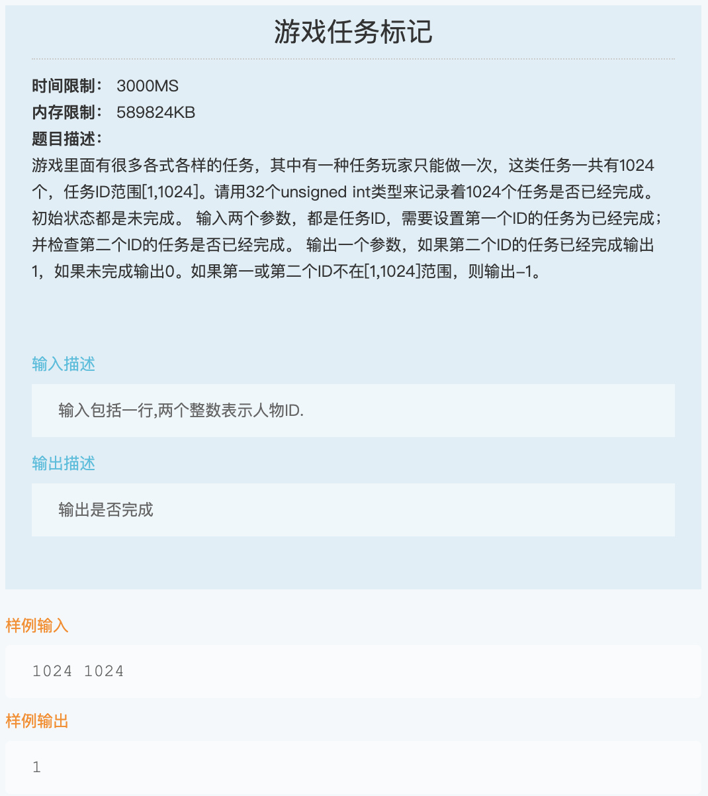
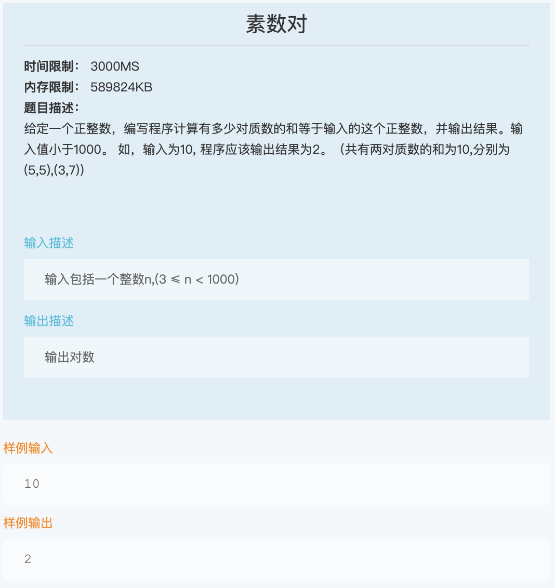
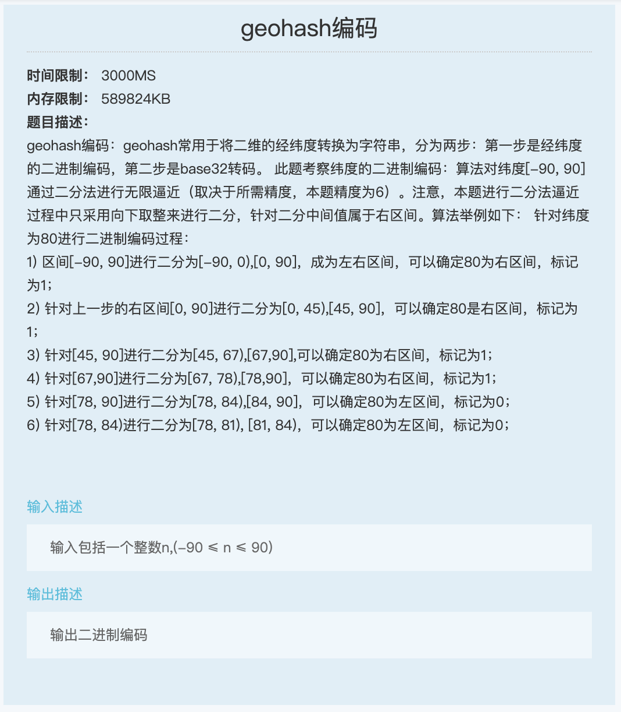
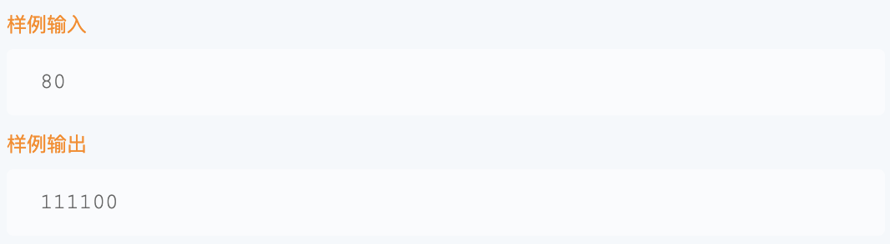

# 腾讯 2021 秋招

## 1. 编码【等比数列】



```js
const CHAR_RANGE_COUNT = 25;
const MAX_STRING_LEN = 4;

function getIndexOfEncodedString(s) {
  let res = -1;
  let pow = 1;
  for (let i = 0; i < MAX_STRING_LEN; ++i) {
    pow *= CHAR_RANGE_COUNT;
  }
  for (let i = 0; i < s.length; ++i) {
    const letterIndex = s[i].charCodeAt(0) - 'a'.charCodeAt(0);
    const base = (1 - pow) / (1 - CHAR_RANGE_COUNT);
    res += letterIndex * base + 1;
    pow /= CHAR_RANGE_COUNT;
  }
  return res;
}
```

## 2. 游戏任务标记【签到】



```js
const TASK_COUNT = 1024;

function markGameTask(taskId1, taskId2) {
  if (
    taskId1 < 1 ||
    taskId1 > TASK_COUNT ||
    taskId2 < 1 ||
    taskId2 > TASK_COUNT
  ) {
    return -1;
  }
  return taskId1 === taskId2 ? 1 : 0;
}
```

## 3. 素数对【质数】



```js
function isPrime(num) {
  if (num < 2) {
    return false;
  }
  for (let i = 2; i * i <= num; ++i) {
    if (num % i === 0) {
      return false;
    }
  }
  return true;
}

function getPrimePairCount(sum) {
  let res = 0;
  for (let i = 2; i <= sum / 2; ++i) {
    if (isPrime(i) && isPrime(sum - i)) {
      res += 1;
    }
  }
  return res;
}
```

## 4. geohash 编码【二分】





```js
function geohashLatitude(lat) {
  let res = '';
  const MIN_LATITUDE = -90;
  const MAX_LATITUDE = 90;
  const PRECISION_LEN = 6;
  let lo = MIN_LATITUDE;
  let hi = MAX_LATITUDE;
  for (let i = 0; i < PRECISION_LEN; ++i) {
    const mi = Math.floor((lo + hi) / 2);
    if (lat < mi) {
      hi = mi;
      res += '0';
    } else {
      lo = mi;
      res += '1';
    }
  }
  return res;
}
```
