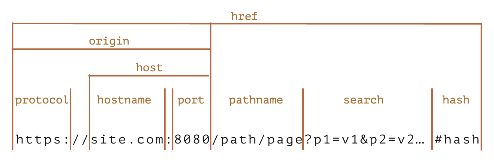

# URL

## 解析 URL

类似于 `new URL(url)`，返回一个对象，包含 protocol、hostname、port 等属性。



```js
const parseURL = url => {
  const protocolRegexp = '(?:(?<protocol>(?:https?|ftp):)//)?';
  const hostnameRegexp =
    '(?<hostname>[a-zA-Z0-9]+(?:-[a-zA-Z0-9]+)*(?:\\.[a-zA-Z0-9]+(?:-[a-zA-Z0-9]+)*)*)';
  const portRegexp = '(?::(?<port>\\d+))?';
  const pathnameRegexp = '(?<pathname>(?:/\\w*)*)';
  const searchRegexp = '(?<search>(?:[?&]\\w+=\\w*)*)';
  const hashRegexp = '(?<hash>#\\w*)?';
  const urlRegexp =
    protocolRegexp +
    hostnameRegexp +
    portRegexp +
    pathnameRegexp +
    searchRegexp +
    hashRegexp;
  const regexp = new RegExp(urlRegexp);
  const res = regexp.exec(url);
  // undefined 替换为空串
  Object.keys(res.groups).forEach(key => {
    if (res.groups[key] === undefined) {
      res.groups[key] = '';
    }
  });
  const { protocol, hostname, port } = res.groups;
  // 拼接 host 和 origin
  const host = hostname + (port ? `:${port}` : '');
  const origin = (protocol ? `${protocol}//` : '') + host;
  return {
    ...res.groups,
    host,
    origin,
    href: url,
  };
};
```

## query string 与对象互相转换

```js
const qs = {
  parse(s) {
    const obj = {};
    s.split('&')
      .map(item => item.split('='))
      .forEach(([key, value]) => {
        obj[key] = value;
      });
    return obj;
  },
  stringify(obj) {
    return Object.keys(obj).reduce(
      (s, key, index) => s + (index > 0 ? '&' : '') + `${key}=${obj[key]}`,
      ''
    );
  },
};
```
