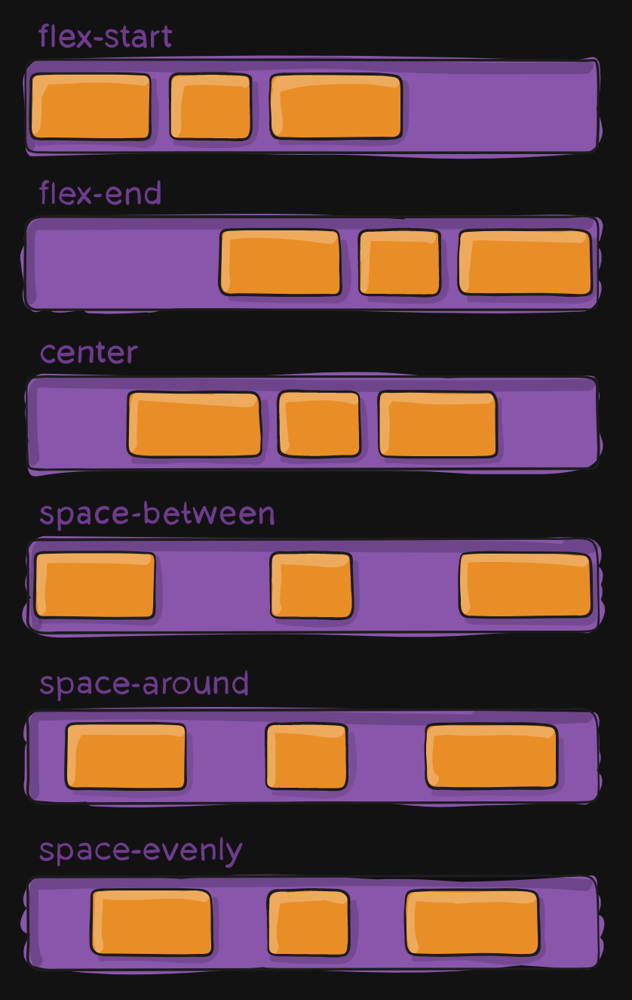
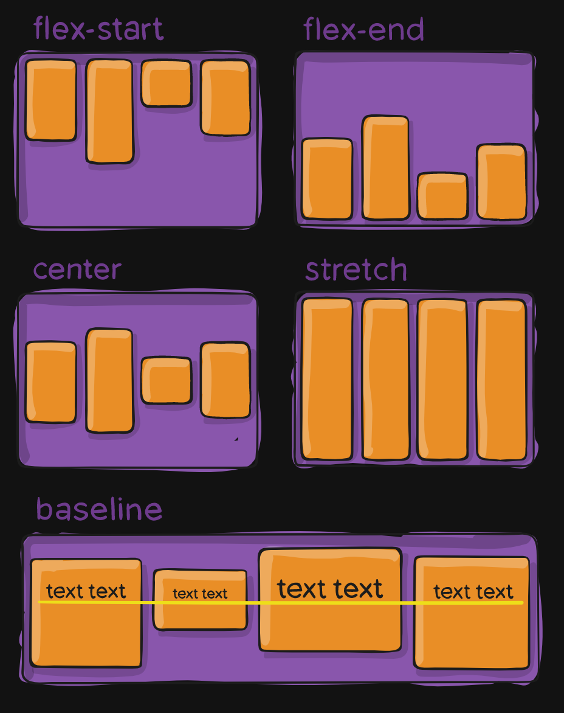

# flex 布局

flex 是一种新的排版上下文，语法更直观、使用更方便。

可以控制子级盒子的：
- 摆放方向
- 水平和垂直方向的对齐
- 摆放顺序
- 盒子的宽高
- 是否折行

## flex-direction

`flex-direction` 控制子级盒子的摆放方向，也就是主轴 (main axis) 的方向：
- `row` (默认)：从左到右
- `row-reverse`：从右到左
- `column`：从上到下
- `column-reverse`：从下到上

与主轴垂直的方向为交叉轴 (cross axis)。

## justify-content

`justify-content` 控制主轴上的对齐方式：
- `flex-start` (默认)：靠主轴开始侧，`row` 就是靠左对齐
- `flex-end`：靠主轴结束侧，`row` 就是靠右对齐
- `center`：居中对齐，`row/row-reverse` 就是水平居中
- `space-between`：占满整行/整列，子元素间距相等，两侧边缘无间距
- `space-around`：两侧边缘间距是中间间距的一半
- `space-evenly`：两侧边缘有间距，所有间距等长

## align-items

`align-items` 控制交叉轴上的对齐方式：

