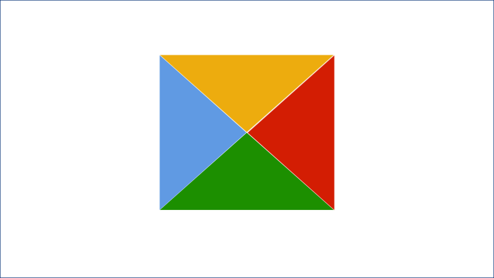
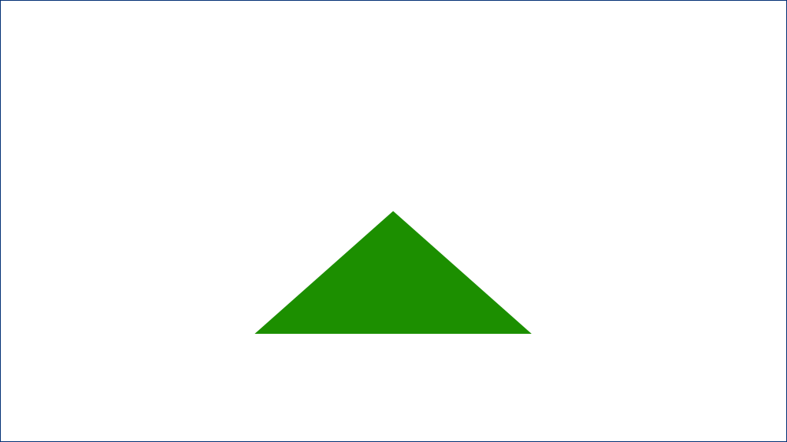

# 几何图形

## 三角形

`width` 和 `height` 设成 0，`border-width` 不为 0，就得到了 4 个三角形。



把其中 3 个 `border-color` 设为 `transparent`，就得到了 1 个三角形。



调整 4 条边框的宽度就能得到不同形状的三角形。

```css
width: 0;
height: 0;
border-style: solid;
border-color: transparent;
border-bottom-color: green;
```

### 等腰三角形

```css
border-width: 0 100px 200px 100px; // 锐角
border-width: 0 100px 100px 100px; // 钝角
```

### 等边三角形

```css
border-width: 0 100px 173px 100px; // sqrt(3)
```

### 直角三角形

```css
border-width: 0 100px 100px 0;
```

## 椭圆

### 圆/椭圆

```css
border-radius: 50%;
```

### 半椭圆

```css
border-radius: 50% / 100% 100% 0 0;
```

### 四分之一椭圆

```css
border-radius: 100% 0 0 0;
```
