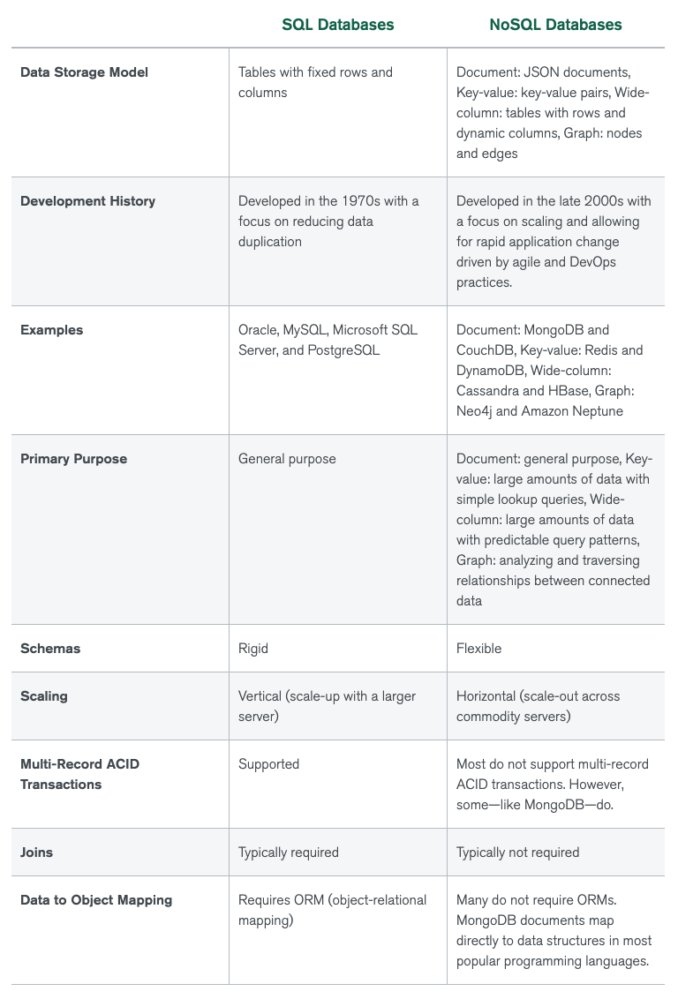

# SQL 与 NoSQL

SQL:

- 数据模型是二维表格，表中所有记录遵循相同的模式
- 支持连接操作，支持 ACID 事务
- 适用场景：
  - 通用目的，适用于各种场景
- SQL 数据库：Oracle, MySQL, Microsoft SQL Server, PostgreSQL

NoSQL:

- 数据模型有 JSON 文档 (MongoDB)、键值对 (Redis)、宽列 (Cassandra)、图 (Neo4j)，每条记录的模式可以不同
- 可以不支持连接操作，通常不支持 ACID 事务 (MongoDB 支持)
- 适用场景：
  - 文档：通用目的。
  - 键值对：大量数据的简单查询。
  - 宽列：大量数据的有固定模式的查询。
  - 图：遍历和分析数据之间的关系。
- 相比 SQL 更方便水平扩展 (scale-out)
- NoSQL 数据库：
  - Document: MongoDB, CouchDB
  - Key-value: Redis, DynamoDB
  - Wide-column: HBase, Cassandra
  - Graph: Neo4j, Apache Neptune
