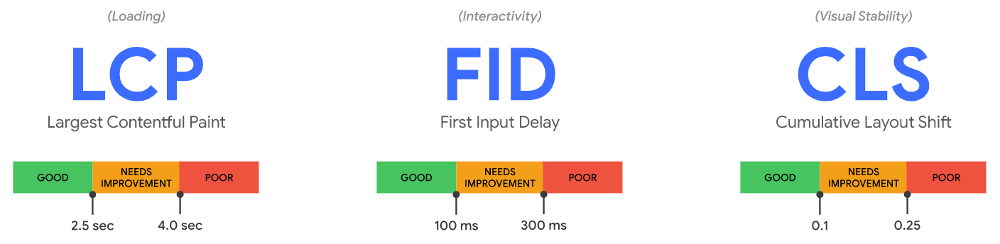

# Web 性能指标

- LCP (Largest Contentful Paint)
  - 最大内容绘制
  - 测量加载性能 (Loading)
  - 应该小于 2.5 s
- FID (First Input Delay)
  - 首次输入延迟
  - 测量交互性 (Interactivity)
  - 应该小于 100 ms
- CLS (Cumulative Layout Shift)
  - 累积布局偏移
  - 测量视觉稳定性 (Visual Stability)
  - 应该小于 0.1

## LCP

页面可视区域内最大元素完成渲染的时间，相对于页面首次开始加载的时间。

考虑的元素类型：

- `` 元素
- 内嵌在 `<svg>` 元素中的 `<image>` 元素
- `<video>` 元素
- 通过 `url()` 函数加载背景图片的元素
- 包含文本节点或行级文本元素的块级元素

确定元素的大小：

- 只考虑可见区域，不考虑溢出部分
- 对于图片，考虑原始尺寸和可见尺寸的较小值
- 对于文本，只考虑文本节点的大小 (包含所有文本节点的最小矩形)
- 不考虑 margin、border、padding

计算过程：

- 浏览器绘制第一帧后立即分发一个 LCP 类型的 `PerformanceEntry`
- 渲染后续帧时，如果有新的**可见**元素比最大元素更大，分发一个新的 `PerformanceEntry`
  - 只会考虑可见元素初次渲染时的大小，后续的尺寸和位置改变不会被考虑
  - 如果元素在屏幕外完成渲染，后续变为可见，不会被考虑
- 如果最大元素被移除，仍保持这个元素为最大元素
- 当用户开始交互时 (点击、滚动、触摸)，浏览器停止分发 `PerformanceEntry`
- 最新的一条 `PerformanceEntry` 代表了绘制的最大内容

## FID

从用户第一次与页面交互到浏览器做出响应、开始执行处理程序所需的时间。

- 只考虑不连续操作 (点击、触摸)，不考虑连续操作 (滚动、缩放)
- 测量从接收到事件到主线程下一次空闲的时间差值，没有处理程序也可以计算 FID
- 输入延迟主要是由页面加载过程中长任务的阻塞造成的

## CLS

会话窗口内所有意外布局偏移的最大累计分数。

会话窗口 (session window)：连续发生的一连串布局偏移，每次偏移的间隔时间小于 1 秒，窗口的最大时长为 5 秒。

<video src="./assets/session-window.webm" muted controls width="70%"></video>

布局偏移 (layout shift)：可见元素的起始位置在相邻两帧之间发生了变更。

- 不考虑新元素添加到 DOM 或已有元素的大小发生改变
- 如果某个元素的大小改变造成其他元素的起始位置变更，视为其他元素的布局偏移
- 浏览器会分发 `layout-shift` 类型的 `PerformanceEntry`

不稳定元素：发生布局偏移的元素。

布局偏移分数 = 影响分数 (impact fraction) \* 距离分数 (distance fraction)

影响分数：相邻两帧**所有**不稳定元素的可见区域集合占总可见区域的比例。

距离分数：不稳定元素在相邻两帧中位移的**最大**距离占可见区域较大尺寸维度的比例 (宽度或高度，以较大者为准)。

预期布局偏移：对用户交互进行响应的布局偏移通常没有问题，在用户进行不连续输入 500 ms 内的布局偏移会带有 `hadRecentInput` 标记，CLS 的计算会排除这些偏移。

- CSS 的 `transform` 不改变元素的起始位置，不会触发布局偏移
  - 用 `scale()` 代替对 `width` 和 `height` 的修改
  - 用 `translate()` 代替对 `top/bottom/left/right` 的修改

意外布局偏移：不属于预期布局偏移即为意外布局偏移。

## 测量工具

- web-vitals 库
- Chrome DevTools Lighthouse
