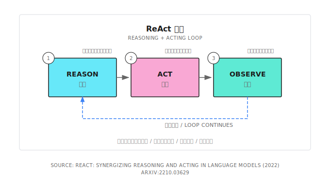

# ReAct 循环

Reasoning + Acting，思考、行动、观察的循环，Agent 核心执行模式。

2022 年论文：[ReAct: Synergizing Reasoning and Acting in Language Models](https://arxiv.org/abs/2210.03629)

## 核心流程

1. 输入提示词，LLM 思考下一步动作
2. 调用工具、执行动作，得到输出结果
3. 观察结果、输入给下一轮思考
4. 终止条件：LLM 认为任务完成，或触发约束 (最大轮数/预算耗尽/无新进展)

## 终止条件

| 条件     | 说明                             | 优先级 |
| -------- | -------------------------------- | ------ |
| 用户中断 | 用户主动停止                     | 0      |
| 预算耗尽 | 达到 token/成本上限，强制停止    | 0.5    |
| 超时     | 达到端到端时延上限，强制停止     | 0.5    |
| 最大轮数 | 达到预设的 MaxIterations         | 1      |
| 最小轮数 | 强制执行指定轮数                 | 2      |
| 任务完成 | LLM 明确表示任务已完成           | 3      |
| 结果收敛 | 连续两次观察结果很像，没有新进展 | 4      |
