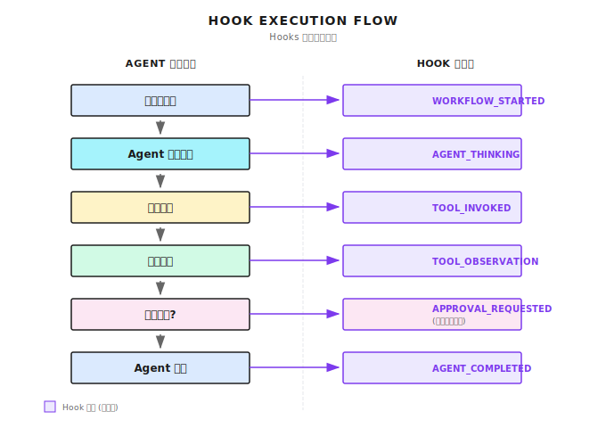

# Hook

不修改核心代码的情况下，观测执行状态、插入自定义逻辑。

- 可观测性：Agent 执行到哪一步了
- 可控性：关键节点暂停、确认后再继续
- 可扩展性：不改核心代码的情况下添加功能

缺点：

- Hook 太多或太慢会影响 Agent 执行效率

## Hook 事件

可以订阅事件，做自定义操作：写日志、发通知、暂停流程、人工审批。

## Claude Code Hooks

定义在 `.claude/hooks` 目录下，用独立脚本实现，通过 stdin/stdout 通信。

优点：

- 语言无关，支持任何能写脚本的语言
- Hook 独立进程，崩溃不影响主进程

缺点：

- 每次调用启动新进程，有性能开销
- 不支持持久化状态
