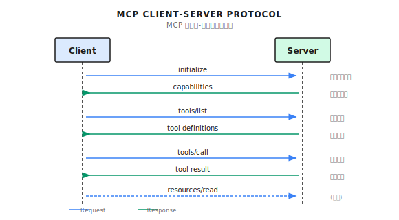

# MCP

Model Context Protocol，工具统一接口、统一工具的发现/调用/授权，用于调用外部系统工具、统一格式，避免重复开发工具的鉴权、错误处理、重试等逻辑。

Agent 只需要实现 MCP Client，就能调用不同外部系统 MCP Server 的工具，而不需要了解具体 API 格式。

## 核心概念

- `MCP Client`：调用工具、使用资源，比如 Claude Code/Cursor
- `MCP Server`：提供工具、暴露资源，比如 GitHub/Database/Figma Server
- `Transport`：消息传输方式，比如 stdio/http

## 支持操作

- `Tools`：写操作、改变状态
- `Resources`：读操作、不改变状态
  - 支持订阅变更，数据变化时 Server 主动推送

## 通信流程

初始化 -> 工具发现 -> 工具调用



## 创建 MCP Server

启动 Server 的脚本：

```py
from mcp.server import Server
from mcp.server.stdio import stdio_server

server = Server("weather-server")

@server.tool("get_weather")
async def get_weather(city: str) -> dict:
    """Get current weather for a city.

    Args:
        city: Name of the city (e.g., "Tokyo", "New York")
    """
    # 实际实现会调用天气 API
    return {"city": city, "temp": 22, "condition": "sunny"}

if __name__ == "__main__":
    import asyncio
    asyncio.run(stdio_server(server))
```

Claude Code 配置：

- 项目级：`.mcp.json`
- 用户级：`~/.claude.json`

```json
{
  "mcpServers": {
    "weather": {
      "command": "python",
      "args": ["path/to/weather_server.py"]
    }
  }
}
```

## 安全问题

- 提示词注入
  - 过滤工具返回内容
  - 用特殊标记包裹工具输出，避免识别为指令
  - 提示词明确以下为工具返回数据、非指令
- 工具权限问题
  - 只给 Agent 必要的工具
  - 文件相关工具设置路径白名单
  - 禁止部分工具的组合
- 类似名称的 Server
  - 使用 [MCP Registry](https://registry.modelcontextprotocol.io) 验证 Server 身份
