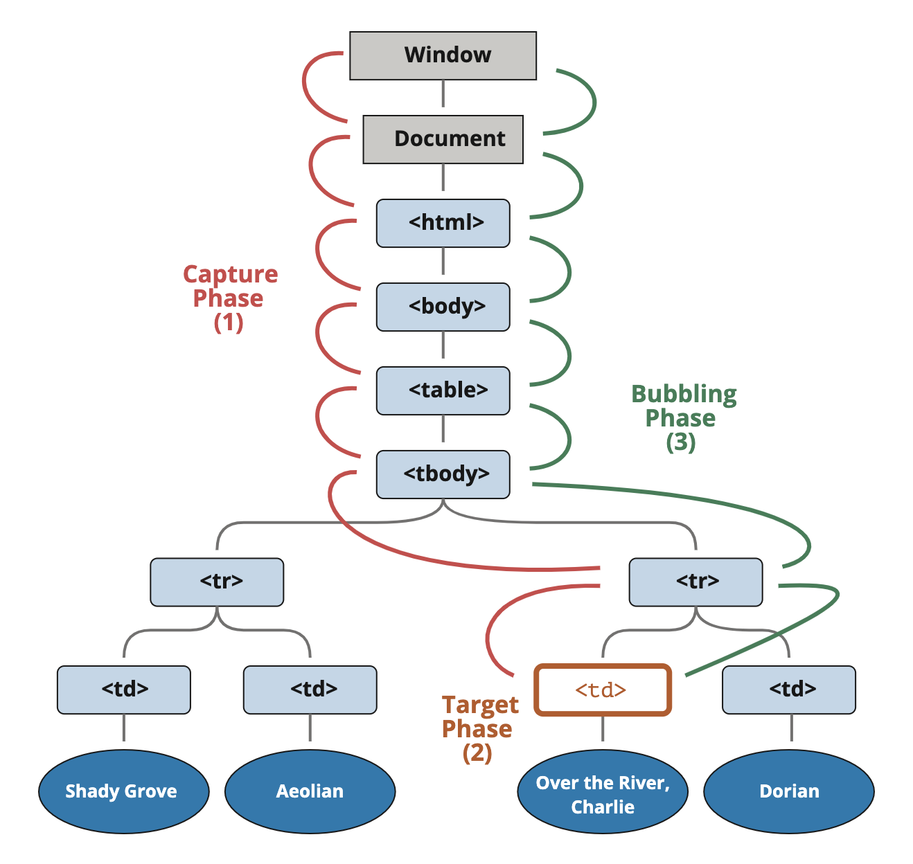

# 事件

## 捕获 (capture)

事件传播有 3 个阶段：

- 捕获 (capturing)
- 目标 (target)
- 冒泡 (bubbling)



`on<event>` 和 `addEventListener(event, func)` 默认在冒泡阶段触发。

`addEventListener(event, func, { capture: true })` 会使 `func` 在捕获阶段触发。

简写：`addEventListener(event, func, true)`

删除时也需要指定捕获阶段：`removeEventListener(event, func, true)`

事件对象属性 `event.eventPhase` 表示当前事件传播的阶段。

## 冒泡 (bubble)

冒泡：首先触发**最深层元素**的处理函数，然后是父元素，依此类推直到根元素。

几乎所有事件都会冒泡，除了 `focus` 等少数事件。

访问触发事件的元素：

- `event.target`：嵌套最深的直接元素
- `this` 或 `event.currentTarget`：当前冒泡到的元素，当前处理函数所在的元素

通常冒泡会以 `document` 对象或 `window` 对象结束，也可以在处理函数中手动停止冒泡。

- `event.stopPropagation()`：停止冒泡，阻止父元素的处理函数执行
- `event.stopImmediatePropagation()`：停止冒泡，并阻止当前元素在当前事件上的其他处理函数执行

## 事件处理程序

事件处理程序 (**event handler**) 是在事件触发时执行的函数，可以有多个。

### addEventListener

添加处理程序：

```js
element.addEventListener(event, handler[, options]);
element.addEventListener(event, handler[, capture]);
```

- `event`：事件名，String
- `handler`：处理函数
- `options`：
  - `once`：是否触发 1 次后被移除
  - `capture`：是否在捕获阶段执行处理函数
  - `passive`：设为 true 表示处理函数不会调用 preventDefault()
    - 如果调用了，会被忽略并在控制台打印警告

移除处理程序：

```js
element.removeEventListener(event, handler[, options]);
```

每种事件可能绑定了多个处理函数，所以需要传入相同的函数才能正确移除。

某些事件只能使用 `addEventListener`，比如 `DOMContentLoaded` 和 `transitionend`。

事件的详细信息会作为 event 对象传入处理程序的第一个参数。

event 对象属性：

- `type`：事件名，String
- `target`：触发事件的最内层元素
- `currentTarget`：执行处理程序的当前元素，与 this 相同
- ...... (每种类型的事件都有自己独有的一组属性)

### 事件处理对象

除了指定一个函数作为处理程序，还可以指定一个具有 `handleEvent` 方法的对象，对于复杂繁琐、代码量大的处理函数，就可以封装到一个类或对象里，从而提高可读性。

```js
class Menu {
  handleEvent(event) {
    // mousedown -> onMousedown
    let method = 'on' + event.type[0].toUpperCase() + event.type.slice(1);
    this[method](event);
  }

  onMousedown() {
    elem.innerHTML = 'Mouse button pressed';
  }

  onMouseup() {
    elem.innerHTML += '...and released.';
  }
}
```

## 事件类型

鼠标事件：

- `click`
- `mouseenter`/`mouseleave`
- `mouseover`/`mouseout`
- `mousedown`/`mouseup`
- `contextmenu`

键盘事件：

- `keydown`/`keyup`

表单事件：

- `submit`
- `focus`

DOM 事件：

- `DOMContentLoaded`

CSS 事件：

- `transitionend`
