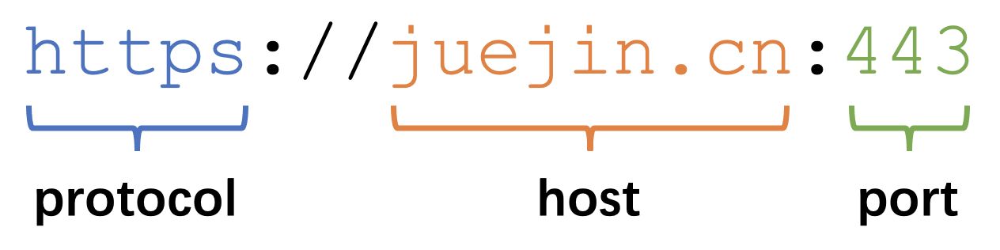
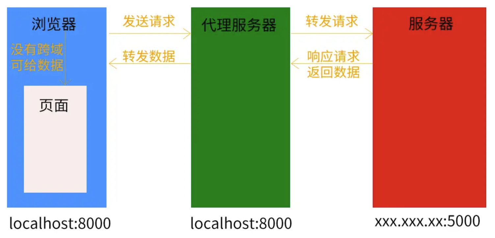

# 跨域

跨域问题 (cross origin) 来源于浏览器的同源策略 (same-origin policy)。

## 浏览器的同源策略

同源策略由 NetScape 于 1995 年引入浏览器，目的是为了保证用户信息安全，防止恶意网站窃取用户数据 (比如 Cookie)。目前所有浏览器都实行这个策略。

同源：两个 URL 的协议 (**protocol**)、主机名 (**host**)、端口 (**port**) 都相同。



请求与当前页面不同源的 URL 即为跨域。

常见的跨域请求：

- AJAX 请求，比如 `XMLHttpRequest` 和 `Fetch`

原生支持跨域：

- `@font-face` 引入字体
- `<link>` 引入 CSS
- `<script>` 引入 JavaScript 脚本
- `` 引入图片
- `<audio>` 引入音频、`<video>` 引入视频
- `<iframe>` 引入外部页面
- `<object>`、`<embed>` 引入外部资源

同源策略对跨域请求做了以下限制：

- AJAX 无法请求非同源 URL
- 无法读取非同源 Cookie、localStorage、IndexedDB
- 无法读取非同源 DOM (`iframe` 或 `window.open`)

## CORS

CORS 在服务端做配置，返回 `Access-Control-*` 响应头。

- 优点：
  - 支持全部 HTTP 请求
  - 通信过程由浏览器完成、对用户透明、使用方便
- 缺点：
  - 服务端需要做额外配置

[CORS](./cors.md)

## JSONP

JSONP (JSON with Padding) 利用 `<script>` 允许跨域的特点实现从非同源 URL 获取 JSON 数据。

- 优点：
  - 兼容性好，支持老式浏览器
  - 不需要服务端做配置
- 缺点：
  - 只支持 `GET` 请求

原理：拥有 `src` 属性的标签不受浏览器同源策略的影响，可以请求跨域资源。

- `<script>`
- ``
- `<iframe>`

JSONP 的工作流程如下：

1. 声明一个回调函数，参数是将要请求的数据，函数内可以对数据进行后续的处理。
2. 构造 `<script>` 元素，将 `src` 属性设为接口地址，并带上回调函数名的 query param。
3. `<script>` 元素加入 DOM，自动请求接口，返回的 JS 脚本会包含对回调函数的调用，传入的参数就是希望从后端获取的数据。
4. JS 脚本自动执行，回调函数以请求数据为参数被执行。

```html
<script>
  function userCallback(userData) {
    console.log(`User data received: ${userData}`);
  }
</script>
<script src="http://api.example.com/users/123?callback=userCallback"></script>
```

```js
userCallback({
  id: '123',
  name: 'Test User',
  email: 'test@example.com',
});
```

## 代理服务器

原理：同源策略是浏览器提出的，Node 没有同源策略。(跨域只存在于浏览器)

配置与前端同源的代理服务器，负责转发请求和响应，代理服务器和后端不需要同源。



## WebSocket

原理：WebSocket 不执行同源策略，允许跨域。

但是一般不会为了跨域就把 HTTP 请求换成 WebSocket 通信。
