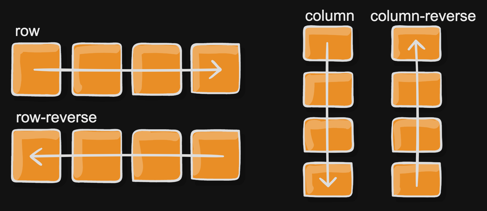
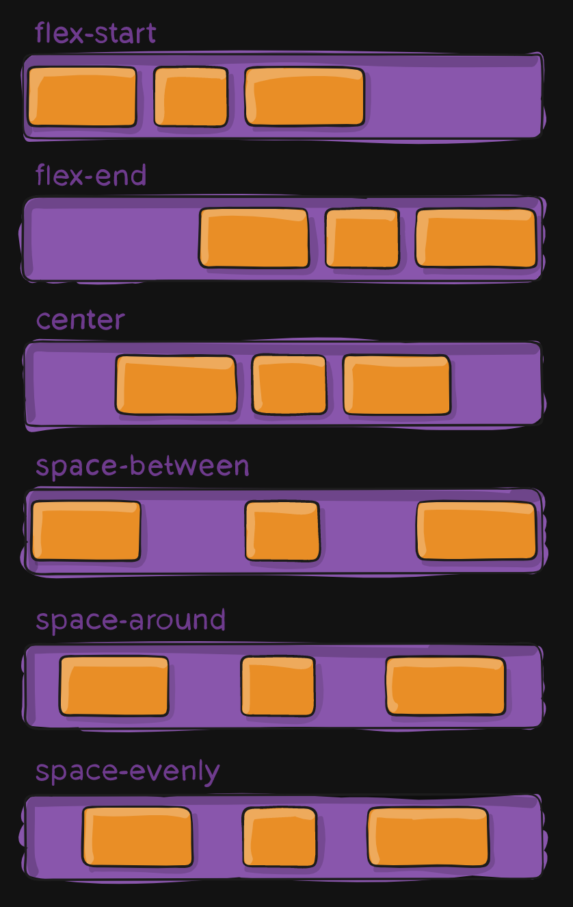
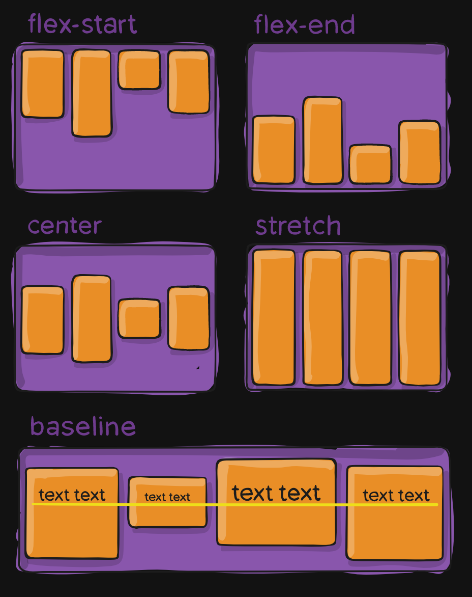

# flex 布局

flex 是一种新的排版上下文，语法更直观、使用更方便。

可以控制子级盒子的：

- 摆放方向
- 水平和垂直方向的对齐
- 摆放顺序
- 盒子的宽高
- 是否折行

## flex-direction

`flex-direction` 控制子级盒子的摆放方向，也就是主轴 (main axis) 的方向：

- `row` (默认)：从左到右
- `row-reverse`：从右到左
- `column`：从上到下
- `column-reverse`：从下到上



与主轴垂直的方向为交叉轴 (cross axis)。

## justify-content

`justify-content` 控制主轴上的对齐方式：

- `flex-start` (默认)：靠主轴开始侧，`row` 就是靠左对齐
- `flex-end`：靠主轴结束侧，`row` 就是靠右对齐
- `center`：居中对齐，`row/row-reverse` 就是水平居中
- `space-between`：占满整行/整列，子元素间距相等，两侧边缘无间距
- `space-around`：两侧边缘间距是中间间距的一半
- `space-evenly`：两侧边缘有间距，所有间距等长



## align-items

`align-items` 控制交叉轴上的对齐方式：



## flex-grow

`flex-grow` 指定子元素的放大比例，默认是 `0`，有剩余空间也不放大。

```css
.item {
  flex-grow: <number>; /* default 0 */
}
```

如果所有项目的 `flex-grow` 属性都为 `1`，则它们将等分剩余空间（如果有的话）。

如果一个项目的 `flex-grow` 属性为 `2`，其他项目都为 `1`，则前者占据的剩余空间将比其他项多一倍。

## flex-shrink

`flex-grow` 指定子元素的缩小比例，默认是 `1`，如果空间不足元素将缩小。不能为负值。

```css
.item {
  flex-shrink: <number>; /* default 1 */
}
```

如果所有项目的 `flex-shrink` 属性都为 `1`，当空间不足时，都将等比例缩小。

如果一个项目的 `flex-shrink` 属性为 `0`，其他项目都为 `1`，则空间不足时，前者不缩小。

## flex-basis

`flex-basis` 指定子元素的基础大小，根据所有子元素的基础大小计算容器的剩余空间或需要收缩的空间。默认是 `auto`，项目的本来大小。

```css
.item {
  flex-basis: <length> | auto; /* default auto */
}
```

可以指定为绝对值 (与 `width` 或 `height` 相等)，使元素不会放大和缩小。

## flex

`flex-grow flex-shrink flex-basis` 的简写，可以指定 1/2/3 个值。默认是 `0 1 auto`。

- 1 个值
  - `initial` => `0 1 auto`
  - `auto` => `1 1 auto`
  - `none` => `0 0 auto`
  - `<number>` => `<number> 1 0`
  - `<width>` => `1 1 <width>`
- 2 个值
  - `<number> <number>` => `<number> <number> auto`
  - `<number> <width>` => `<number> 1 <width>`
- 3 个值
  - `<number> <number> <width>`
