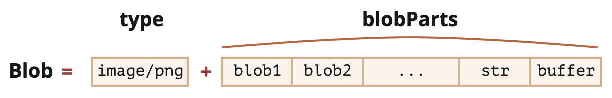

# Blob

`ArrayBuffer/TypedArray/DataView` 是 ECMA 标准的一部分，由 JS Runtime 实现，浏览器和 Node 通用。

`Blob` 属于浏览器提供的 **File API**，由 `blobParts` 和可选的 `type` 组成。



创建 `Blob`：

```js
new Blob(blobParts, [options]);
```

- `blobParts`：`Blob/buffer/String` 类型的数组
- `options`：
  - `type`：通常是 MIME 类型
  - `endings`：是否转换换行符，默认 `transparent` 不转换，设为 `native` 转换

方法：

- `slice([byteStart], [byteEnd], [contentType])`
  - `[byteStart, byteEnd)` 的 Blob 片段
  - 类型是 `contentType` (默认与源 Blob 相同)

## URL

转为 `<a>`、`` 等标签的 URL。

```js
const link = document.createElement('a');
link.download = 'hello.txt';
const blob = new Blob(['Hello, world!'], { type: 'text/plain' });
link.href = URL.createObjectURL(blob);
link.click();
// 手动释放内存
URL.revokeObjectURL(link.href);
```

## Data URL

转为 `` 等标签的 Data URL。

```js
const link = document.createElement('a');
link.download = 'hello.txt';
const blob = new Blob(['Hello, world!'], { type: 'text/plain' });
const reader = new FileReader();
reader.readAsDataURL(blob);
reader.onload = () => {
  // Data URL
  link.href = reader.result;
  link.click();
};
```

## canvas

`canvas` 图像转为 Blob。

```js
const img = document.querySelector('img');
const canvas = document.createElement('canvas');
canvas.width = img.clientWidth;
canvas.height = img.clientHeight;
const context = canvas.getContext('2d');
context.drawImage(img, 0, 0);
canvas.toBlob(blob => {
  const link = document.createElement('a');
  link.download = 'example.png';
  link.href = URL.createObjectURL(blob);
  link.click();
  URL.revokeObjectURL(link.href);
}, 'image/png');
```

## ArrayBuffer

转为 `ArrayBuffer`。

```js
const buffer = await blob.arrayBuffer();
```

## stream

转为 stream。

```js
const readableStream = blob.stream();
const stream = readableStream.getReader();
while (true) {
  let { done, value } = await stream.read();
  if (done) {
    console.log('all blob processed.');
    break;
  }
  console.log(value);
}
```
