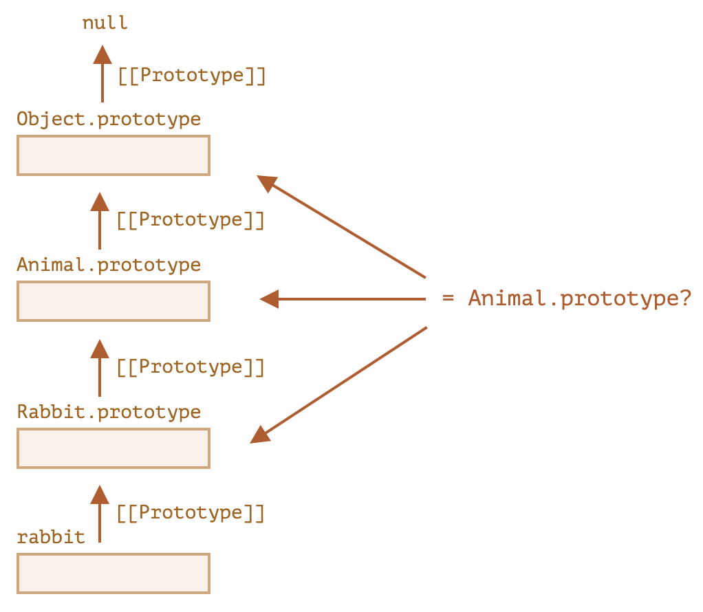

# 类型判断

## typeof

区分 8 种基本类型 (`null` 和 `Function` 是特例)，返回参数类型的字符串。

```js
typeof 0; // number
typeof 0n; // bigint
typeof ''; // string
typeof true; // boolean
typeof null; // object
typeof undefined; // undefined
typeof Symbol('id'); // symbol
typeof {}; // object
typeof alert; // function
```

- `typeof null` 结果是 `object`，这是 JS 早期的实现错误，为了兼容性保留下来，实际上 `null` 与 `object` 毫无关系，是两种不同的数据类型
- `typeof alert` 结果是 `function`，实际上函数也属于对象类型，但 `typeof` 会区别对待函数，这是 JS 早期的遗留问题，但也带来了一些方便

## instanceof

区分**对象**所属的 `class` 或构造函数，对于祖先类也成立，不支持原始类型。

```js
obj instanceof Class;
```

执行过程：

1. 如果 `Class` 有静态方法 `Symbol.hasInstance`，就直接调用。
2. 大部分 `Class` 没有这个方法，就检查 `Class.prototype` 是否在 `obj` 的原型链上
   - 等价于 `Class.prototype.isPrototypeOf(obj)`



## Object.prototype.toString()

`Object.prototype.toString()` 把对象转换为字符串，返回格式统一为 `[object Class]`。

既能区分原始类型，也能区分不同的对象类型。

```js
const objectToString = Object.prototype.toString;
objectToString.call(1); // [object Number]
objectToString.call(1n); // [object BigInt]
objectToString.call(''); // [object String]
objectToString.call(true); // [object Boolean]
objectToString.call(null); // [object Null]
objectToString.call(undefined); // [object Undefined]
objectToString.call(Symbol('id')); // [object Symbol]
objectToString.call({}); // [object Object]
objectToString.call(alert); // [object Function]
objectToString.call([]); // [object Array]
```

`[object xxx]` 中的 `xxx` 由对象属性 `[Symbol.toStringTag]` 决定，可以通过设置这个属性来修改 `toString()` 的输出。

```js
let user = {
  [Symbol.toStringTag]: 'User',
};
alert({}.toString.call(user)); // [object User]
```

大多数内置对象 (`window`) 都有这个属性：

```js
alert(window[Symbol.toStringTag]); // Window
alert({}.toString.call(window)); // [object Window]
```

## Array.isArray()

`Array` 静态方法，判断是否为数组。

```js
Array.isArray(value);
```

## obj.constructor

通过 `obj.constructor` 访问原型上的构造函数，从而得到所属的类型。
