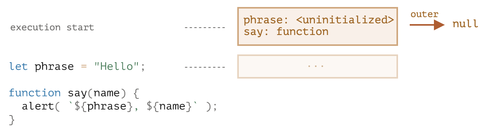
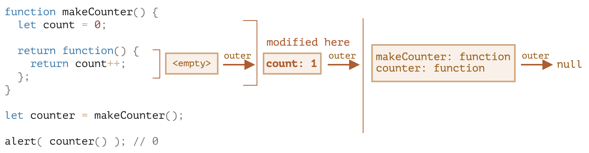

# 闭包

闭包 (closure) 是指函数声明时会绑定外部环境，无论传递到哪里调用，函数内都能访问到**声明时**的外部变量 (外部环境)。

通常用于函数一等公民的编程语言。

## 作用域与词法环境

变量有 3 种作用域，只在所处的作用域中可见：

- 全局作用域
- 函数作用域
- 块作用域

每个作用域有一个称为**词法环境 (Lexical Environment)** 的隐藏对象。

词法环境有 2 部分：

- 环境记录 (Environment Record)：作用域内所有局部变量
- 对外部词法环境的引用 (全局词法环境无外部引用)

对于**变量**来说，词法环境预先读取所有声明的变量，设为未初始化 (Uninitialized) 状态，在遇到声明之前不能引用，就像该变量不存在一样。遇到声明语句后，变量可以被读取和修改。


对于**函数**来说，词法环境会预先**读取并初始化**所有声明的函数，允许调用下方声明的函数。



访问变量时，首先搜索当前作用域的词法环境，其次是外部以及更外部，直到全局。

如果都没找到，严格模式下报错，非严格模式下会声明一个全局变量。

## 闭包

函数作用域也有自己的词法环境，使用 `[[Environment]]` 隐藏属性存储对外部环境的引用，创建函数时会自动设置这个属性。

不管这个函数被传递到什么地方调用，调用时的外部词法环境永远是**声明时**的外部环境，与调用时的外部环境无关，保证了函数的可用性。



## 使用场景

任何需要访问函数外变量的场景，核心是创建私有变量、延长变量的生命周期。

1. 各种回调函数
   - setTimeout
   - addEventListener
2. 返回函数的函数，返回的函数需要访问函数内声明的变量
   - 防抖、节流
   - 柯里化
3. 模拟私有属性和方法：IIFE 返回公有方法，需要访问 IIFE 函数内的私有属性和方法
4. 解决 var 没有块作用域的问题
   - 外面包一层 IIFE 传入参数来固定 var 变量的值

## 垃圾回收

函数执行结束后，如果没有其他环境引用这个函数环境，该环境会从内存中删除（垃圾回收）。

对于返回函数的函数，由于返回的函数引用了外部函数的词法环境，就不会发生垃圾回收，直到返回的函数不再使用，才会回收外部函数。

```js
function f() {
  let value = 123;
  return function () {
    console.log(value);
  };
}
// g 函数存在时，f 不会被回收
let g = f();
// g 和 f 都可以回收了
g = null;
```

目前主流的 V8 引擎会对这种情况做一些优化，如果返回的函数**没有引用外部环境的任何变量**，则会将外部函数从外部环境链上删除，并允许回收外部函数。

```js
let value = 'Surprise!';

function f() {
  let value = 'the closest value';
  function g() {
    // 在 Console 中输入 value 会显示 "Surprise!"，意味着 f 被回收了
    debugger;
  }
  return g;
}

let g = f();
g();
```
