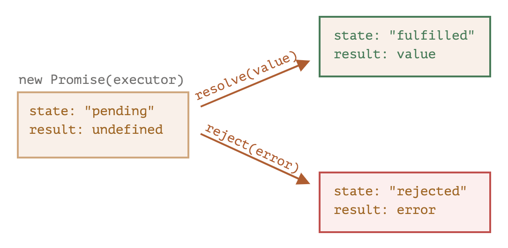
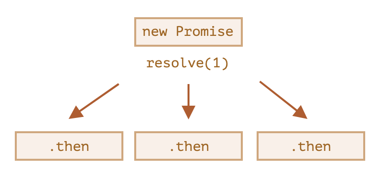
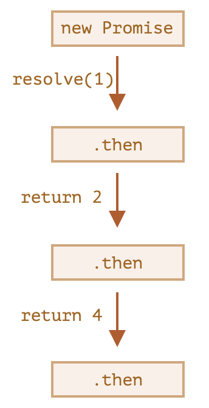

# Promise

## 异步

开发中有时需要**异步**执行代码，一段时间后开始执行，再过一段时间执行完成，但不知道确切的执行开始和结束的时间，但是可以确保在**有限**时间内最终一定会执行完成。

由于 JavaScript 是**单线程**执行，耗时过长的同步代码会阻塞 UI 的更新，造成用户交互无响应，用户体验很差。为了避免这种情况，网络请求、密集计算等任务都采用异步方式执行，与 UI 操作并发运行，保证基本的用户交互。

## 回调函数

通常需要在异步代码执行完成后做一些操作，这些操作会用到异步执行的变量或结果，可以绑定一个**回调函数 (callback)**，异步代码执行结束后自动触发回调函数的执行。

这种通常称为 “基于回调” (callback-based) 的异步编程风格。

回调函数通常需要处理**执行成功**和**执行出错**两种情况，比如执行成功后进行下一步操作，执行出错则打印错误信息、抛出异常等。

由于异步执行在 JS 中用的很多，经常需要串联多个异步执行的结果，就需要编写嵌套的回调函数，而多层嵌套的可读性和可维护性都很差，称为**回调地狱 (callback hell)**。

```js
loadScript("/my/script.js", function (script) {
  loadScript("/my/script2.js", function (script) {
    loadScript("/my/script3.js", function (script) {
      // ...加载完所有脚本后继续
    });
  });
});
```

迫切需要 JS 提供一种新的异步代码编写方法，支持更优雅的异步执行链的编写。

## Promise

ES6 引入的 `Promise` 不仅解决了回调地狱的问题，而且提供了更丰富和功能和更直观的语法。

把需要异步执行的代码包装成一个函数 (称为 `executor`)，传入 `Promise` 的构造函数创建一个 `promise` 对象：

```js
let promise = new Promise(function (resolve, reject) {
  // executor（异步执行的代码）
});
```

- `resolve(value)`：执行成功时的回调函数，`value` 表示希望暴露给外界的结果
- `reject(error)`：执行出错时的回调函数，`error` 表示错误对象

`Promise` 的执行只能有一个结果，要么被 `resolve`、要么被 `reject`，一旦有其中一个函数被调用，函数立即返回。

`promise` 对象有 2 个**内部**属性：

- `state`：状态
  - `pending`：初始值
  - `fulfilled`：调用 `resolve` 后
  - `rejected`：调用 `reject` 后
- `result`：结果
  - `undefined`：初始值
  - `value`：调用 `resolve(value)` 后
  - `error`：调用 `reject(error)` 后



为了能在异步代码执行成功或出错后做一些操作，可以使用 `then` 和 `catch` 方法。

### then

`then` 指定 `resolve` 和 `reject` 后的回调函数：

```js
promise.then(
  function (result) {
    /* handle a successful result */
  },
  function (error) {
    /* handle an error */
  }
);
```

如果只对执行成功感兴趣，可以不指定 `reject` 的回调。这也是比较常用的写法，错误处理使用专用的 `catch`，看起来更清晰。

```js
let promise = new Promise((resolve) => {
  setTimeout(() => resolve("done!"), 1000);
});
promise.then(alert); // 1 秒后显示 "done!"
```

可以在一个 `promise` 上多次调用 `then`，进行彼此间独立的多个操作，无先后顺序。



### catch

`catch` 其实是 `then(null, errorHandler)` 的简写，专门用于错误处理。

```js
let promise = new Promise((resolve, reject) => {
  setTimeout(() => reject(new Error("Whoops!")), 1000);
});
promise.catch(alert); // 1 秒后显示 "Error: Whoops!"
```

### finally

类似于 `try...catch` 语句，`promise` 也有 `finally` 方法。当 `promise` 执行结束后，`finally` 都会执行，无论是 `resolve` 还是 `reject`。`finally` 与 `then` 的执行顺序取决于声明时的顺序。

```js
new Promise((resolve, reject) => {
  setTimeout(() => resolve("value"), 2000);
})
  .finally(() => alert("Promise ready")) // 先触发
  .then((result) => alert(result)); // <-- .then 显示 "value"
```

### 永远 pending

如果 promise 内部既没有调用 `resolve` 也没有调用 `reject`，这个 promise 将永远处于 `pending` 状态，`then/catch/finally` 都不会被调用。

## Promise 链

`then` 的返回值会被包装成一个新的 `promise`，因此可以链式地调用 `then`，实现异步代码的串行处理。

```js
new Promise(function (resolve, reject) {
  setTimeout(() => resolve(1), 1000);
})
  .then(function (result) {
    alert(result); // 1
    return result * 2;
  })
  .then(function (result) {
    alert(result); // 2
    return result * 2;
  })
  .then(function (result) {
    alert(result); // 4
    return result * 2;
  });
```

1 -> 2 -> 4 会被依次 alert。



也可以返回一个 `promise`，包装延时代码，实现延时返回。

```js
new Promise(function (resolve, reject) {
  setTimeout(() => resolve(1), 1000);
})
  .then(function (result) {
    alert(result); // 1
    return new Promise((resolve, reject) => {
      setTimeout(() => resolve(result * 2), 1000);
    });
  })
  .then(function (result) {
    alert(result); // 2
    return new Promise((resolve, reject) => {
      setTimeout(() => resolve(result * 2), 1000);
    });
  })
  .then(function (result) {
    alert(result); // 4
  });
```

## 错误处理

错误来源：

- `reject`
- `throw`：`throw error` 相当于 `reject(error)`

错误发生后，会跳转到最近的 `catch` 函数。如果 `catch` 处理了错误，则错误不会继续传递，下方的 `then` 会被正常调用 (但是没有结果值)。如果 `catch` 处理不了这个错误，可以重新 `throw` 这个错误，转移给下一个最近的 `catch`。

```js
new Promise((resolve, reject) => {
  throw new Error("Whoops!");
})
  .catch(function (error) {
    alert("The error is handled, continue normally");
  })
  .then(() => alert("Next successful handler runs"));
```

没有被 `catch` 捕获的错误会中止脚本的执行，在控制台报错。

## async/await

### async

`async` 用于装饰一个函数，表示这个函数始终返回一个 promise，函数内返回的非 promise 值会被包装成 resolve 后的 promise。

### await

`await` 用于等待一个 promise 出结果，只能用于 `async` 函数中。

```js
async function f() {
  let promise = new Promise((resolve, reject) => {
    setTimeout(() => resolve("done!"), 1000);
  });
  let result = await promise; // 等待，直到 promise resolve
  alert(result); // "done!"
}
```

执行过程中碰到 `await`，会暂定当前任务的执行，直到 promise 被 resolve 或 reject 后，才会返回继续执行。在此过程中，CPU 可以调度给其他任务使用。既利用了异步执行的非阻塞优点，也便于编写串行处理逻辑。

`await` 是 `promise.then` 的更优雅写法。允许在模块中使用顶层 `await`。

如果 promise 被 reject，`await` 会 throw 返回的 error，可以用 `try...catch` 捕获。

```js
async function f() {
  try {
    let response = await fetch("http://no-such-url");
  } catch (err) {
    alert(err); // TypeError: failed to fetch
  }
}
```

也可以对 `async` 函数的返回值进行 `catch`。

```js
async function f() {
  let response = await fetch("http://no-such-url");
}
f().catch(alert); // TypeError: failed to fetch
```
