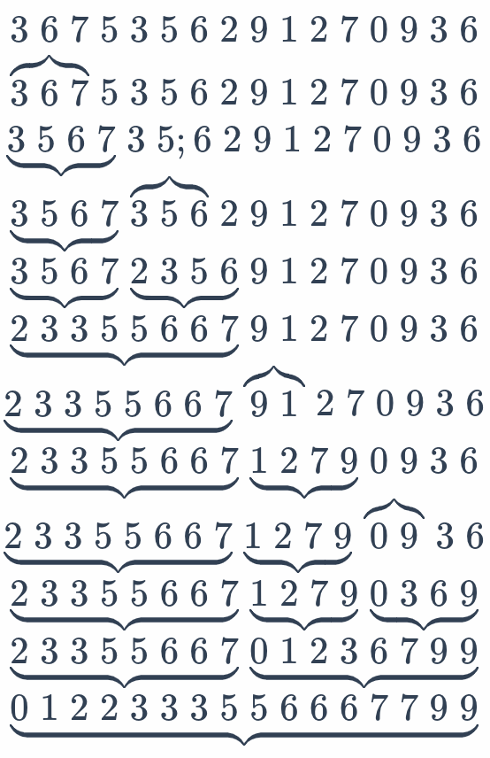

# Timsort

ES2019 后标准规定 `Array.prototype.sort` 必须是稳定的，具体使用的排序算法取决于实现。

V8 使用 **Timsort** 对元素进行排序，Timsort 是一种归并排序的变体。

| 排序算法 | 平均时间复杂度 | 最坏时间 | 最好时间 | 空间复杂度 | 稳定性 |
| -------- | -------------- | -------- | -------- | ---------- | ------ |
| 快速排序 | O(nlogn)       | O(n^2)   | O(nlogn) | O(logn)    | 不稳定 |
| 归并排序 | O(nlogn)       | O(nlogn) | O(nlogn) | O(n)       | 稳定   |
| 插入排序 | O(n^2)         | O(n^2)   | O(n)     | O(1)       | 稳定   |
| Timsort  | O(nlogn)       | O(nlogn) | O(n)     | O(n)       | 稳定   |

选择 Timsort 有以下原因：

- 优秀的时间复杂度：最坏 O(nlogn)、最好 O(n)
- 具有稳定性，能满足标准的要求

## run

Timsort 中的 run 表示一段有序的序列：

- 升序：a[i-1] <= a[i] <= a[i+1]
- 严格降序：a[i-1] > a[i] > a[i+1]

严格降序序列可以通过简单的翻转得到升序序列。

此处要求严格降序而不是降序是因为：

- 降序序列翻转后可能会破坏稳定性
- 严格降序可以保证所有元素都不相同

原始数组可能已经包含若干个 run，Timsort 称之为 natural run。

## minrun

Timsort 定义了 run 的最小长度 minrun，如果 natural run 的长度小于 minrun，则使用插入排序补充到 minrun 的长度。

如果数组长度为 n，则总共会生成 floor(n/minrun) 个初始 run。

minrun 的选取基于以下原则：

- 如果 floor(n/minrun) 是 2 的幂或者稍小一些，归并过程将在两个长度接近的 run 之间发生，会比较高效
- 如果 floor(n/minrun) 比 2 的幂稍大一些，最后将是一个超长 run 和一个超短 run 进行合并，额外开销会很大

所以需要选取 minrun 使 floor(n/minrun) 是 2 的幂或稍小一些。

Tim 测试了 8/16/32/64/128/256 这几个 2 的幂作为 minrun 的值，发现：

- 如果选取 8，函数调用次数会非常多
- 如果选取 256，插入排序的元素移动次数会非常多
- 最终选择了 [32, 64] 作为 minrun 的范围，正中间的范围

minrun 的具体计算方法如下：

- 如果 n < 64，则 minrun = n
  - 小数组全部使用插入排序
- 否则在 [32, 64] 范围内选取 minrun，使 floor(n/minrun) 是 2 的幂或稍小一些

```ts
function compute_minrun(n: number): number {
  if (n < 0) return 0;
  let r = 0;
  while (n >= 64) {
    r |= n & 1;
    n >>= 1;
  }
  return n + r;
}
```

## 扩充

从左向右扫描，找到尽可能长的 natural run (长度不超过 minrun)：

- 如果等于 minrun，则直接作为一个 run
- 否则使用插入排序把后面的元素插入到前面的 natural run 中，补充至 minrun 的长度

## 合并

每生成一个 run 就尝试进行合并，使最右边的三个 run 满足以下条件 (记为 A/B/C)：

- A > B + C
- B > C

这样是为了让从右到左的 run 长度大致呈指数级递增，便于后续高效合并。

- 如果 A <= B + C，则合并 A/B 或 B/C，取决于哪种合并方式生成的 run 更短
- 如果 A > B + C 或 B <= C，则合并 B/C



参考链接：

- https://v8.dev/blog/array-sort
- https://github.com/python/cpython/blob/main/Objects/listsort.txt
- https://github.com/python/cpython/blob/main/Objects/listobject.c
- https://sikasjc.github.io/2018/07/25/timsort/
