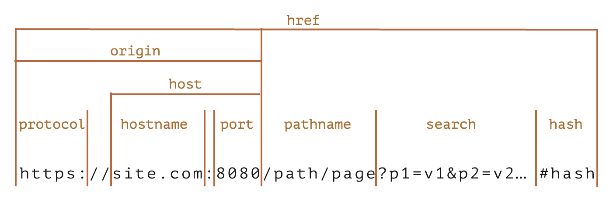

# URL 对象

尽管可以使用字符串作为 URL，但 URL 对象提供了一些便捷的属性和方法，而且大部分接收 URL 的方法也接收 URL 对象。

创建：

```js
new URL(url, [base]);
```

- `url`：URL 或路径 (如果设置了 `base`)
- `base`：base URL

属性：



## URLSearchParams

`url.searchParams` 是 `URLSearchParams` 类型的对象。

方法：

- `append(name, value)`
- `delete(name)`
- `get(name)`
- `getAll(name)`
- `has(name)`
- `set(name, value)`
- `sort()`
- 可迭代
