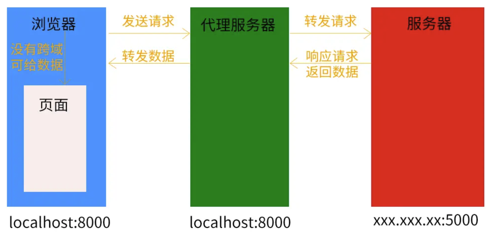

# 跨域

## 浏览器的同源策略

跨域问题与浏览器的同源策略 (**same-origin policy**) 密切相关。

同源策略由 NetScape 于 1995 年引入浏览器，目前所有浏览器都实行这个策略。

目的是为了保证用户信息安全，防止恶意网站窃取用户数据 (比如 Cookie)。

同源指的是两个 URL 的协议 (**protocol**)、主机名 (**host**)、端口 (**port**) 都相同。

比如 `https://juejin.cn:443`：

- 协议：https
- 主机名：juejin.cn (此处是域名，也可以是 IP 地址)
- 端口：443 (HTTPS 端口，在浏览器中省略)

当前页面请求一个不同源的 URL 则构成跨域，有很多场景可能用到跨域资源：

- AJAX 请求，比如 `XMLHttpRequest` 和 `Fetch`
- `<script>` 引入 JavaScript 脚本、`<link>` 引入 CSS、`@font-face` 引入字体
- `` 引入图片、`<audio>` 引入音频、`<video>` 引入视频
- `<iframe>` 引入外部页面

跨域请求有 3 个限制：

- AJAX 无法请求非同源 URL
- 无法读取非同源 Cookie、localStorage、IndexedDB
- 无法读取非同源 DOM (`iframe` 或 `window.open`)

实现跨域请求主要有 2 种方法：`JSONP` 和 `CORS`。

JSONP (JSON with Padding) 利用 `<script>` 允许跨域的特点实现从非同源 URL 获取 JSON 数据。优点是兼容性好，支持老式浏览器，不需要服务端支持 CORS，缺点是只支持 `GET` 请求。

CORS 支持全部 HTTP 请求，通信过程由浏览器完成、对用户透明、使用非常方便，只需要服务端做一些额外的配置，是目前主流的跨域解决方案。

## CORS

`CORS` (Cross-Origin Resource Sharing，跨域资源共享) 是解决**跨域问题**最常用的方法 (另一种方法是 `JSONP`)，这篇文章主要阐述了使用 CORS 处理跨域的一些实现细节。

### CORS 的两种请求

根据是否需要发送预检请求 (preflight) 可以将 CORS 请求分为 2 类：

- 简单请求 (simple request)
- 非简单请求 (not-so-simple request)

#### 简单请求

满足以下 2 个条件的请求为简单请求：

- 请求方法是以下 3 种方法之一：
  - `GET`
  - `HEAD`
  - `POST`
- HTTP Header 只包含以下几种字段：
  - `Accept`
  - `Accept-Language`
  - `Content-Language`
  - `Last-Event-ID`
  - `Content-Type` (只支持以下 3 个值)
    - `application/x-www-form-urlencoded`
    - `multipart/form-data`
    - `text/plain`

对于简单请求，浏览器在 Request Header 中添加一个 `Origin` 字段，表明当前页面的 URL：

```
Origin: http://localhost:5173
```

如果服务端没有配置 CORS 或 `Origin` 的值不在允许的 URL 列表中，则会返回一个正常的 HTTP 响应，不包含额外的 Response Header。浏览器发现响应头没有 `Access-Control-Allow-Origin` 字段，说明这次跨域请求不被服务端支持，则抛出一个错误。

对于服务端支持的 `Origin`，响应头可能包含以下额外字段：

```
Access-Control-Allow-Origin: http://localhost:5173
Access-Control-Allow-Credentials: true
Access-Control-Expose-Headers: FooBar
Content-Type: text/html; charset=utf-8
```

- `Access-Control-Allow-Origin`：服务端允许请求的 URL，取值为 `Origin` 的值或一个星号 `*`，表示允许所有 URL
- `Access-Control-Allow-Credentials`：CORS 请求默认不发送 Cookie，设为 `true` 表示服务端允许发送 Cookie，**不能**设为 `false`，如果不允许 Cookie，不包含这个字段即可
- `Access-Control-Expose-Headers`：可选字段，CORS 请求默认只能拿到响应头的 6 个基本字段，可以在此处指定允许访问的其他字段
  - `Cache-Control`
  - `Content-Language`
  - `Content-Type`
  - `Expires`
  - `Last-Modified`
  - `Pragma`

##### Cookie

如果要通过 CORS 请求发送 Cookie，除了需要服务端设置 `Access-Control-Allow-Credentials` 为 `true` 以及 `Access-Control-Allow-Origin` 不能为 `*`，还需要在 AJAX 中设置：

```js
var xhr = new XMLHttpRequest();
xhr.withCredentials = true; // 发送 Cookie
xhr.withCredentials = false; // 禁止 Cookie
```

#### 非简单请求

不属于简单请求的为非简单请求，通常是 `PUT`、`DELETE` 方法或 `Content-Type` 为 `application/json`。

##### 预检请求 (preflight)

在正式请求之前的一次额外请求，使用 `OPTIONS` 方法询问服务端当前 URL 是否被允许、允许的 Method 和 Header。请求头包含以下的额外字段：

```
Origin: http://localhost:5173
Access-Control-Request-Method: PUT
Access-Control-Request-Headers: X-Custom-Header
```

- `Access-Control-Request-Method`：非简单请求的方法
- `Access-Control-Request-Headers`：可能发送的额外字段

如果服务端允许这三条要求，则发回一条有额外响应头的报文：

```
Access-Control-Allow-Origin: http://localhost:5173
Access-Control-Allow-Methods: GET, POST, PUT
Access-Control-Allow-Headers: X-Custom-Header
Access-Control-Allow-Credentials: true
Access-Control-Max-Age: 1728000
```

- `Access-Control-Allow-Methods`：服务端允许的所有方法，不限于 `Access-Control-Request-Method` 中的方法
- `Access-Control-Allow-Headers`：服务端允许的所有 Header，不限于 `Access-Control-Allow-Headers` 中的 Header
- `Access-Control-Max-Age`：本次预检请求的有效期，以秒为单位

如果服务端不支持这次跨域请求，则返回不包含以上额外 Header 的响应。

##### 正式通信

通过预检请求后，后续的 CORS 请求与简单请求的交互过程相同，Request Header 会包含 `Origin`，Response Header 会包含 `Access-Control-Allow-Origin`。

## JSONP

拥有 `src` 属性的标签不受浏览器同源策略的影响，可以请求跨域资源。

- `<script>`
- ``
- `<iframe>`

JSONP 的工作流程如下：

1. 声明一个回调函数，参数是将要请求的数据，函数内可以对数据进行后续的处理。
2. 构造 `<script>` 元素，将 `src` 属性设为接口地址，并带上回调函数名的 query param。
3. `<script>` 元素加入 DOM，自动请求接口，返回的 JS 脚本会包含对回调函数的调用，传入的参数就是希望从后端获取的数据。
4. JS 脚本自动执行，回调函数以请求数据为参数被执行。

```html
<script>
  function userCallback(userData) {
    console.log(`User data received: ${userData}`);
  }
</script>
<script src="http://api.example.com/users/123?callback=userCallback"></script>
```

```js
userCallback({
  id: "123",
  name: "Test User",
  email: "test@example.com",
});
```

## 代理服务器

配置与前端**同源**的代理服务器，负责转发请求和响应。



原理是代理服务器和后端之间不存在跨域问题 (跨域只存在于**浏览器**)。

## WebSocket

WebSocket 协议不执行同源策略，允许跨域。但是一般不会为了跨域就把 HTTP 请求换成 WebSocket 通信。
