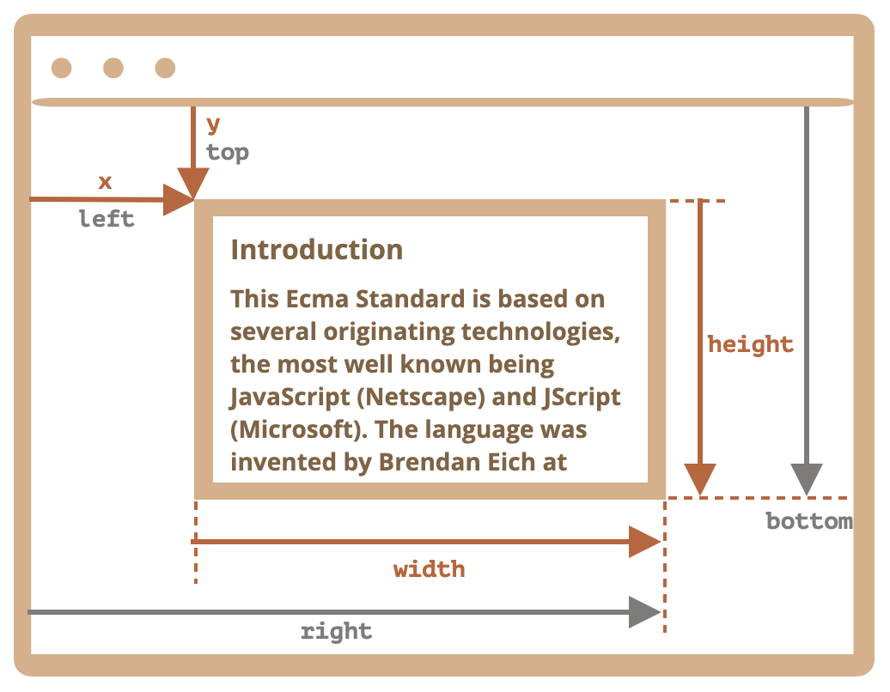

# 元素坐标

有 2 种坐标系：

- 相对于窗口
  - 类似于 `position: fixed`
- 相对于文档
  - 类似于 `position: absolute`

## 窗口坐标



- `getBoundingClientRect`：最小矩形的窗口坐标
  - 返回 `DOMRect` 对象
    - `x/y`：左上角的窗口坐标
    - `width/height`：宽高
    - `top/bottom`：顶部/底部边缘的 Y 坐标
    - `left/right`：左侧/右侧边缘的 X 坐标

## 文档坐标

没有标准方法获取文档坐标，实现方式不唯一。

- 窗口坐标 + 文档滚动出的部分

```js
const rect = elem.getBoundingClientRect();
const top = rect.top + window.pageYOffset;
const left = rect.left + window.pageXOffset;
```

- 累加 `offsetTop/offsetLeft` 直到 `<body>`

```js
const getElementTop = elem => {
  let top = 0;
  while (elem) {
    top += elem.offsetTop;
    elem = elem.offsetParent;
  }
  return top;
};

const getElementLeft = elem => {
  let left = 0;
  while (elem) {
    left += elem.offsetLeft;
    elem = elem.offsetParent;
  }
  return left;
};
```
