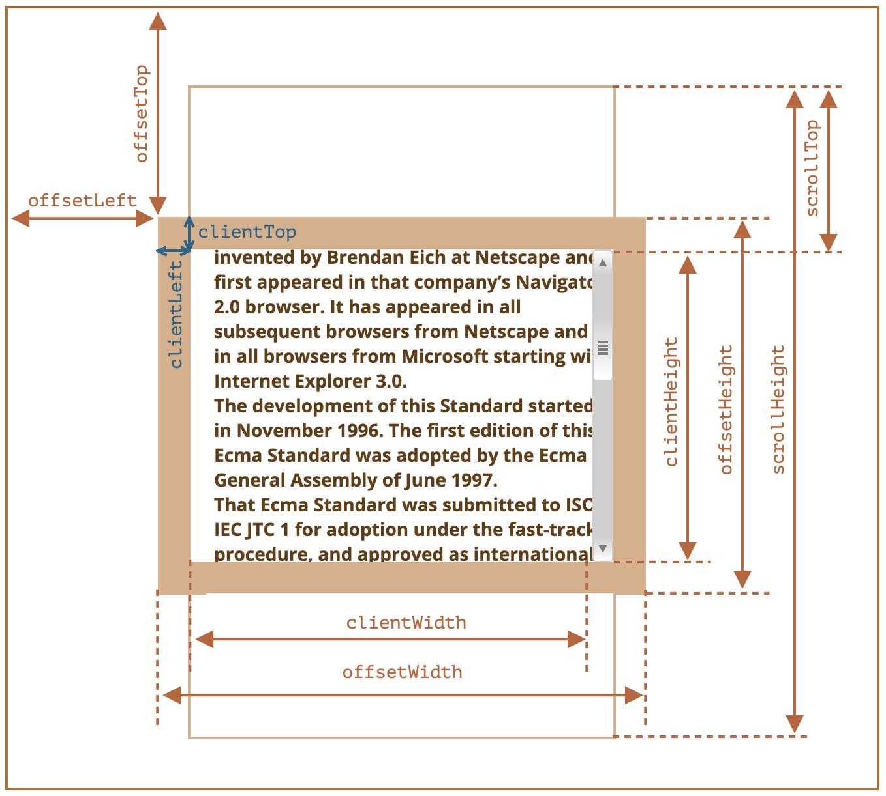

# 元素大小

- `clientWidth/clientHeight`
  - content + padding
  - 不包括滚动条，滚动条会占用一部分 content
- `clientTop/clientLeft`
  - padding 外侧与 border 外侧之间的距离
  - 大部分情况下等于边框的宽度，在从右到左显示的语言中也包括滚动条的宽度
- `offsetWidth/offsetHeight`
  - content + padding + scrollbar + border
  - 包括滚动条和边框
- `offsetParent`
  - 最近的非 `static` 祖先
  - `<td>`、`<th>`、`<table>`
  - `<body>`
- `offsetTop/offsetLeft`
  - 相对 `offsetParent` 的坐标
- `scrollWidth/scrollHeight`
  - 完整 content + padding
  - 类似 `clientWidth/clientHeight`，不包括滚动条
  - content 为完整内容大小，包括滚动出可视区域的部分
- `scrollTop/scrollHeight`
  - 元素隐藏部分的宽高
- ⚠️ 不要使用 CSS 宽高 `getComputedStyle`
  - 取决于 `box-sizing`
  - 可能是 `auto` 而不是数值
  - 不同浏览器对滚动条的处理不一致
