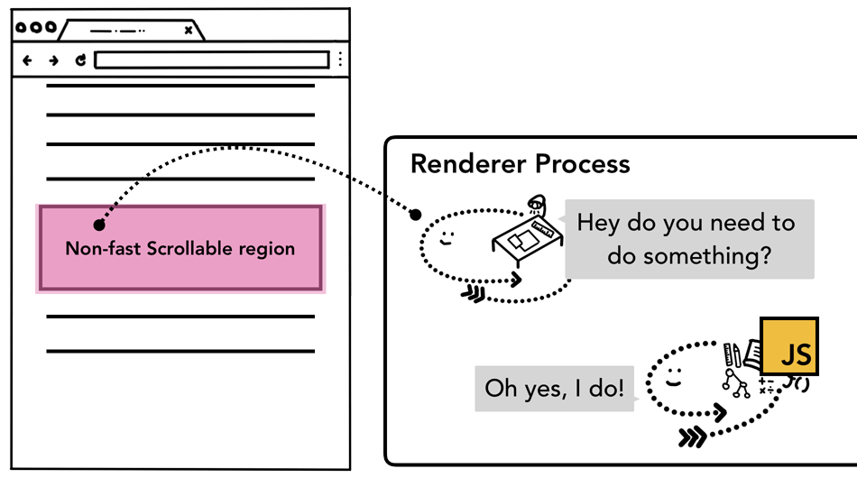
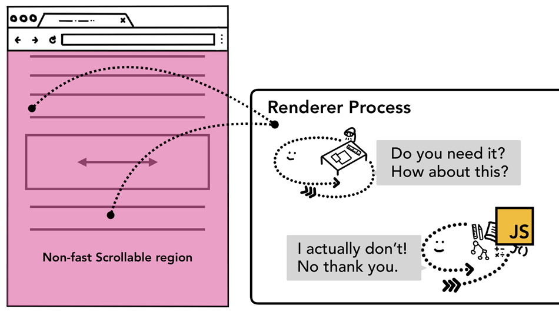

# 事件委托

事件委托 (event delegation)：如果需要为多个子元素添加行为相似的事件处理函数，可以统一在父元素添加一个时间处理函数，函数内部根据 `event.target` 做不同的处理。

```html
<div id="menu">
  <button data-action="save">Save</button>
  <button data-action="load">Load</button>
  <button data-action="search">Search</button>
</div>

<script>
  menu.addEventListener('click', event => {
    const action = event.target.dataset.action;
    if (['save', 'load', 'search'].includes(action)) {
      alert(`${action} done!`);
    }
  });
</script>
```

## 负面影响

事件由渲染器进程的合成器线程处理。页面合成后，合成器线程将绑定了事件处理函数的元素标记为非快速滚动区 (Non-fast Scrollable Region)，发生事件后发送给主线程。



如果事件发生在非快速滚动区外，合成器线程不会等待主线程，而是继续合成新帧。

使用事件委托会导致外层的大面积父元素被标记为非快速滚动区，即使事件发生在不需要处理的元素上，合成器线程也要每次都跟主线程沟通，消除了合成器线程平滑滚动的优势。



为了缓冲事件委托带来的副作用，可以在注册事件处理函数时设置 `{ passive: true }`，提示浏览器在处理事件时可以继续合成新帧。
