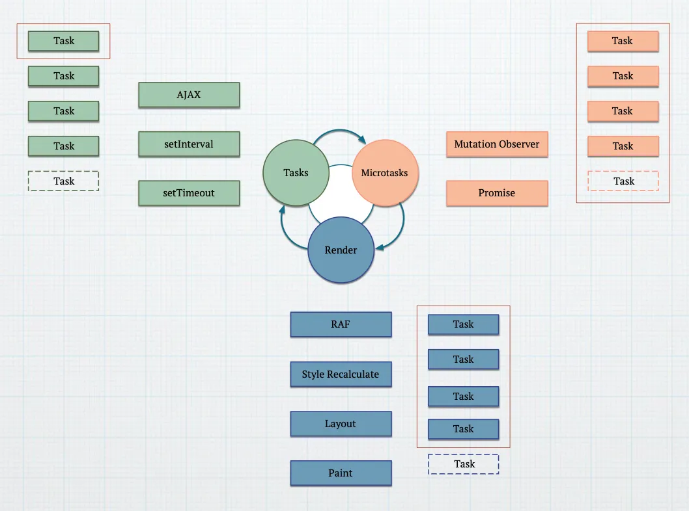

# 浏览器事件循环

浏览器事件循环包含以下阶段：

1. 执行**一个**宏任务
   - `<script>` 脚本
   - 事件处理程序
   - AJAX
   - `setTimeout/setInterval`
2. 执行**所有**微任务
   - Promise 的 `then/catch/finally` 处理程序
   - `queueMicrotask`
   - `MutationObserver`
3. 浏览器渲染

