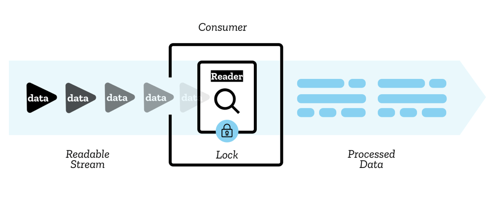

# ReadableStream

ReadableStream 用于流式数据传输，每个流（stream）分为若干个不同大小、类型的数据块（chunk），通过浏览器内部的队列依次传输，最终被 reader 读取和消费。

每个流同时只能有一个 reader 读取，与之相配套的还有一个 controller，负责流的启动、暂停、关闭等管理操作。reader 和其他处理数据的代码统称为消费者（consumer）。



流式传输的数据源可以分为推流（push）和拉流（pull）：

- 推流：视频直播、Websocket
- 拉流：fetch

ReadableStream 是异步可迭代的（async iterable），可以通过 `for await...of` 访问，`Response.body` 就是一个 ReadableStream。

```js
async function readData(url) {
  const response = await fetch(url);
  for await (const chunk of response.body) {
    // 处理每个 chunk
  }
}
```
