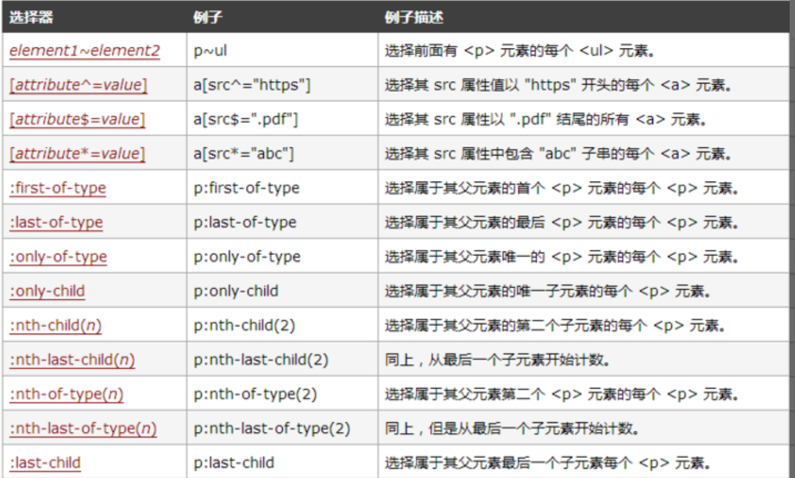

# CSS 3 新增内容

## 选择器

## 边框

- `border-radius`
- `box-shadow`
- `border-image`

## 背景

- `background-clip`
- `background-origin`
- `background-size`
- `background-break`

## 文字

- `word-wrap`
- `text-overflow`
- `text-shadow`
- `text-decoration`

## 颜色

- `rgba`
- `hsla`

## 图片

- `linear-gradient`
- `radial-gradient`

## 变换

- `transform`

## 动画

- `transition`
- `animation`

## 布局

- `flex`
- `grid`
