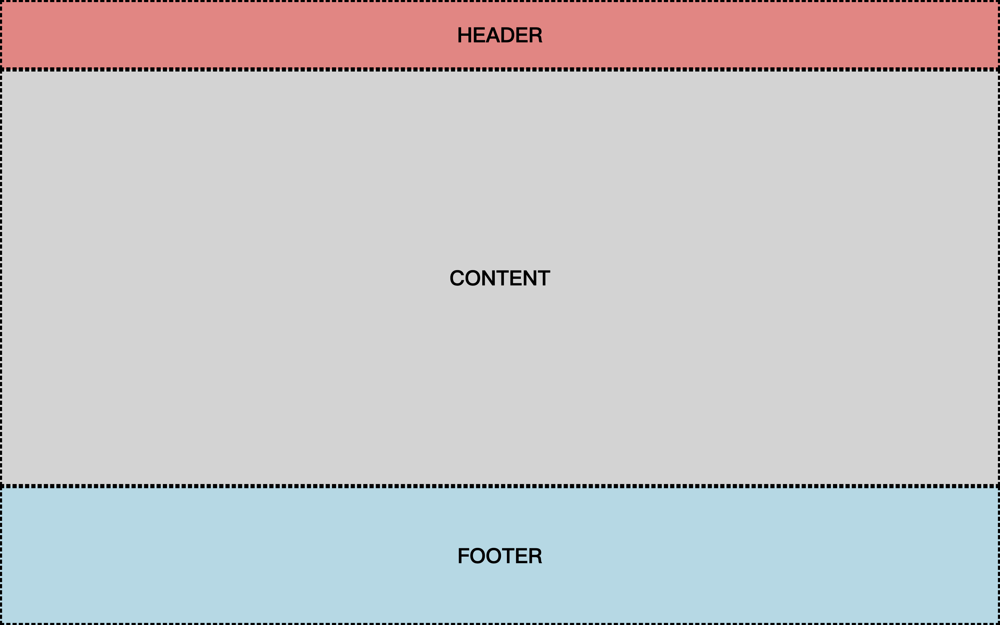

# 上中下布局

整个页面占满屏幕，不能滚动，上面的 header 和下面的 footer 高度固定，中间的 content 填满剩余高度。



```html
<body>
  <div class="container">
    <div class="header"></div>
    <div class="content"></div>
    <div class="footer"></div>
  </div>
</body>
```

## vh + calc()

```css
.header {
  height: 100px;
}

.content {
  height: calc(100vh - 300px);
}

.footer {
  height: 200px;
}
```

## flex

```css
html,
body {
  height: 100%;
}

.container {
  height: 100%;
  display: flex;
  flex-direction: column;
}

.header {
  height: 100px;
}

.content {
  flex: 1;
  overflow: auto;
}

.footer {
  height: 200px;
}
```
