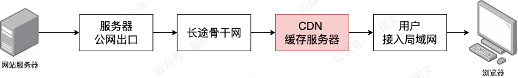
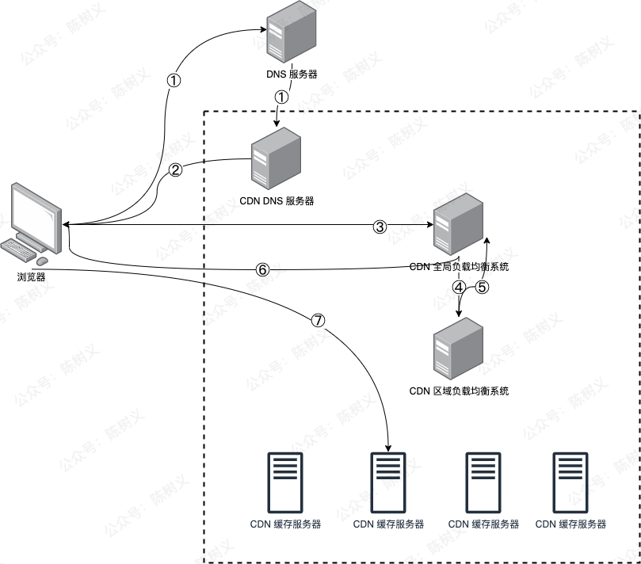

# CDN

**CDN (Content Delivery Network，内容分发网络)** 是分布在不同位置的一组服务器，每个服务器都有资源的一份拷贝，用户请求资源时从距离最近的服务器获取资源，从而实现降低响应时间、提高网站性能的效果。

CDN 通常用于分发静态资源，包括 CSS、JS、图片、视频文件等。

对于动态资源，可以实现最优回源路径的选择。

## 工作原理

1. 浏览器发起图片 URL 请求，经过本地 DNS 解析，会将域名解析权交给域名 CNAME 指向的 CDN 专用 DNS 服务器。
2. CDN 的 DNS 服务器将 CDN 的全局负载均衡设备 IP 地址返回给浏览器。
3. 浏览器向 CDN 全局负载均衡设备发起 URL 请求。
4. CDN 全局负载均衡设备根据用户 IP 地址，以及用户请求的 URL，选择一台用户所属区域的区域负载均衡设备，向其发起请求。
5. 区域负载均衡设备会为用户选择最合适的 CDN 缓存服务器（考虑的依据包括：服务器负载情况，距离用户的距离等），并返回给全局负载均衡设备。
6. 全局负载均衡设备将选中的 CDN 缓存服务器 IP 地址返回给用户。
7. 用户向 CDN 缓存服务器发起请求，缓存服务器响应用户请求，最终将用户所需要偶的内容返回给浏览器。

## 调度模式

- DNS
  - 权威 DNS 服务器 -> 专用 DNS 调度服务器 -> 全局负载均衡服务器 -> 区域负载均衡服务器
  - 区域负载均衡服务器根据地理距离、资源情况、节点负载选出一个最优的节点返回 IP
  - 如果 CDN 没有这个资源，请求源站获取资源并缓存下来
- HTTPDNS
  - 用 HTTP 代替 DNS 传递解析结果
  - 可以避免多种原因导致的 DNS 解析失败问题
  - 适用于客户端
- 302
  - DNS 解析得到 GSLB 集群的 IP，发送请求返回 302，重定向到最优的节点
  - 用于流媒体加速
  - 增加了重定向过程，时延较长

## 优缺点

优点：

- 用户能够从距离最近的服务器获取资源，提高网站的响应速度
  - 解决了跨运营商、跨地域访问的问题
- 降低网站自有服务器的负载，无需提供静态资源
- CDN 已经配置好了资源的缓存策略，无需网站自己维护

缺点：

- 请求数量增加

## 其他

实现技术：

- 负载均衡
- 内容分发与复制
- 缓存

常用 CDN：

- unpkg
- jsDelivr
- BootCDN
- 自建 CDN
