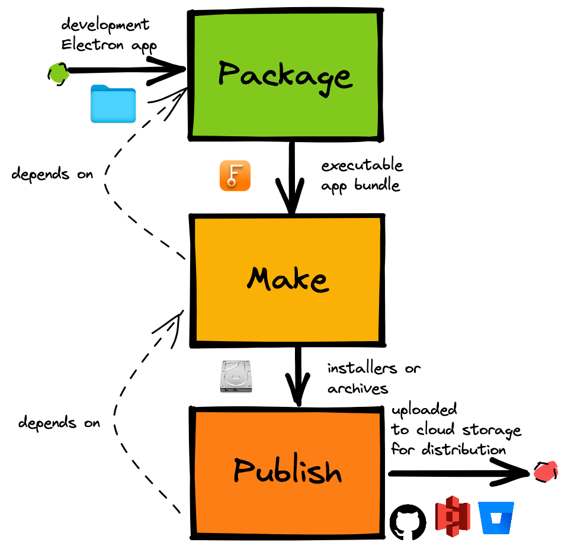

# 打包-构建-发布

从源码到发布主要有 3 个步骤：

1. 打包 (package)：源码 -> 可执行应用 (`.app`/`.exe`)
   - 通常只能打包当前 platform 的产物，比如 macOS 上无法打包 exe 文件
   - 打包产物放在 `out` 目录

```sh
electron-forge package
```

2. 构建 (make)：可执行应用 -> 安装包/压缩包 (`.dmg`/`.msi`/`.zip`)
   - 通常只能构建当前 platform 的产物
   - 构建产物放在 `out/make` 目录

```sh
electron-forge make
```

3. 发布 (publish)：安装包/可执行应用 -> 各种云服务/商店
   - GitHub、App Store、微软商店、自己的网站等
   - 可选，类似于自动部署

```sh
electron-forge publish
```



## package

- `--arch`：CPU 架构
  - 可选：`ia32`、`x64`、`armv7l`、`arm64`、`universal`、`mips64el`
  - 可以指定多个，用逗号 `,` 分隔
  - 默认：当前机器的架构
- `--platform`：操作系统
  - 可选：`darwin`、`mas`、`win32`、`linux`
  - 默认：当前机器的 OS

## make

- `--arch`：同 package
- `--platform`：同 package
- `--targets`：maker 列表，覆盖配置文件
- `--skip-package`：跳过 package
  - 执行 make 默认会执行 package (publish 同理)

## Makers

打包-构建相关的配置。

```js
module.exports = {
  // makers 数组
  makers: [
    // 配置对象
    {
      name: '@electron-forge/maker-zip',
      platforms: ['darwin', 'linux'],
      config: {
        // Config here
      },
    },
    // maker 对象
    new MakerZIP({}, ['darwin', 'linux']),
  ],
};
```

每种 maker 对应一种产物类型，通常只支持特定的 platform，因此 `platforms` 属性一般不需要开发者填写，除非不想生成所有支持的平台。

| maker            | 含义                         | platforms                 |
| ---------------- | ---------------------------- | ------------------------- |
| dmg              | macOS 安装包                 | darwin, mas               |
| pkg              | App Store 应用、macOS 安装包 | darwin, mas               |
| Squirrel.Windows | Windows 应用                 | win32                     |
| msi              | Windows 安装包               | win32                     |
| appx             | Windows 商店应用             | win32                     |
| deb              | Debian 发行版应用            | linux                     |
| rpm              | RedHat 发行版应用            | linux                     |
| flatpak          | Linux 沙箱化应用             | linux                     |
| snap             | Linux 沙箱化应用             | linux                     |
| zip              | 打包产物的压缩包             | darwin, mas, win32, linux |

## publish

- `--target`：publisher 列表，覆盖配置文件
- `--dry-run`：尝试运行，不会上传产物
- `--from-dry-run`：基于之前 `--dry-run` 的结果进行发布

## Publishers

发布相关配置。

```js
module.exports = {
  publishers: [
    {
      name: '@electron-forge/publisher-bitbucket',
      config: {
        repository: {
          owner: 'myusername',
          name: 'myreponame',
        },
      },
    },
  ],
};
```

- Bitbucket：发布到 Bitbucket Downloads
- [Electron Release Server](https://github.com/ArekSredzki/electron-release-server)：自部署的发布服务
- GitHub：发布到 GitHub release

### GitHub release

1. 生成专用的 PAT，只勾选 `public_repo`
2. 安装 GitHub Publisher

```sh
npm i -D @electron-forge/publisher-github
```

3. 修改 Forge 配置文件

```js
module.exports = {
  publishers: [
    {
      name: '@electron-forge/publisher-github',
      config: {
        repository: {
          owner: 'github-user-name',
          name: 'github-repo-name',
        },
        prerelease: false,
        draft: true,
      },
    },
  ],
};
```

4. 配置脚本命令

```json
"scripts": {
  "publish": "electron-forge publish"
},
```

5. 设置 `GITHUB_TOKEN` 环境变量为 PAT，运行脚本

```sh
GITHUB_TOKEN=xxx npm run publish
```

## 跨平台构建
