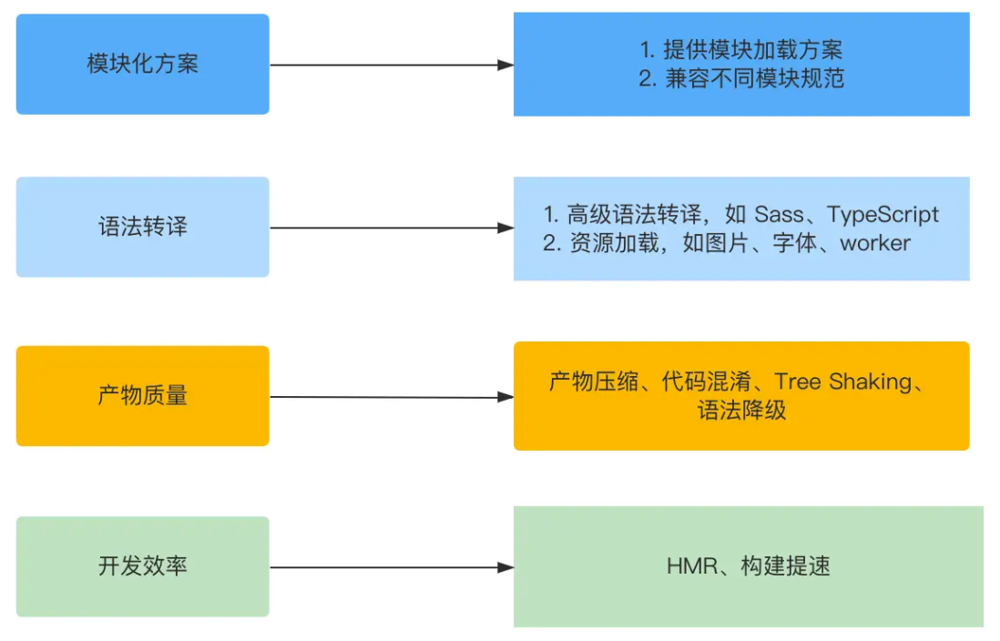

# 前端构建工具

## 模块规范

- CommonJS
  - 最早提出
  - 主要用于 Node 服务端
  - 浏览器需要使用 browserify 打包
  - 同步阻塞的方式加载模块，不太适合在浏览器中运行
- AMD (Asynchronous Module Definition)
  - 异步加载模块，解决了 CommonJS 的同步阻塞问题
  - 需要使用 requireJS 打包
  - 语法复杂，阅读和书写都比较困难
  - 仅仅是一个妥协性的方案
- CMD (Common Module Definition)
  - 阿里在 SeaJS 中提出
  - 与 AMD 类似，语法更简单一点
- UMD (Universal Module Definition)
  - 兼容 CommonJS 和 AMD 的一种方案
  - 可以同时运行在浏览器和 Node 环境
- ESM (ES6 Module)
  - ES 官方提出的模块规范，被现代浏览器原生支持
  - 兼容性较好，覆盖了 90% 以上的浏览器份额
  - Node 12.20+ 原生支持 ESM
  - 能够同时在浏览器和 Node 中执行，天然跨平台

## Webpack 与 Vite 的区别

- 冷启动
  - Webpack
    - 递归打包整个项目的依赖树
    - 使用 JS 编写，有性能瓶颈
  - Vite
    - 使用 esbuild 预构建第三方依赖，使用 Go 编写，速度更快
    - 源码按需编译为 ESM 提供给浏览器
