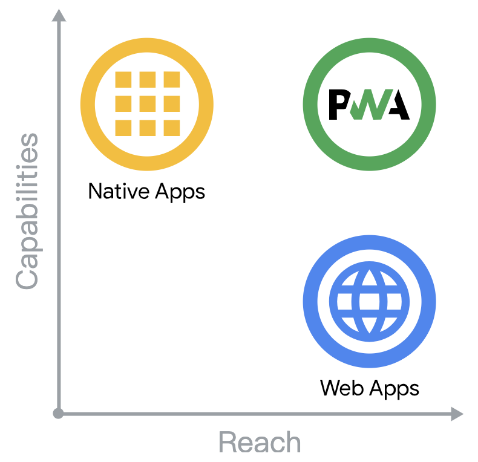

# PWA 概述

渐进式 Web 应用 (Progressive Web App, PWA)：可安装、功能增强的 Web 应用。

三大特点：

- 功能强 Capable
- 可靠 Reliable
- 可安装 Installable

四个用户关切 (F.I.R.E.)：

- 快速 Fast
- 可安装 Installable
- 可靠 Reliable
- 吸引人 Engaging

相关技术：

- Service Worker：缓存资源、prefetch
- Web Push Notifications：推送通知
