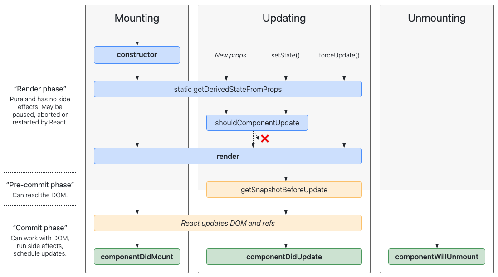
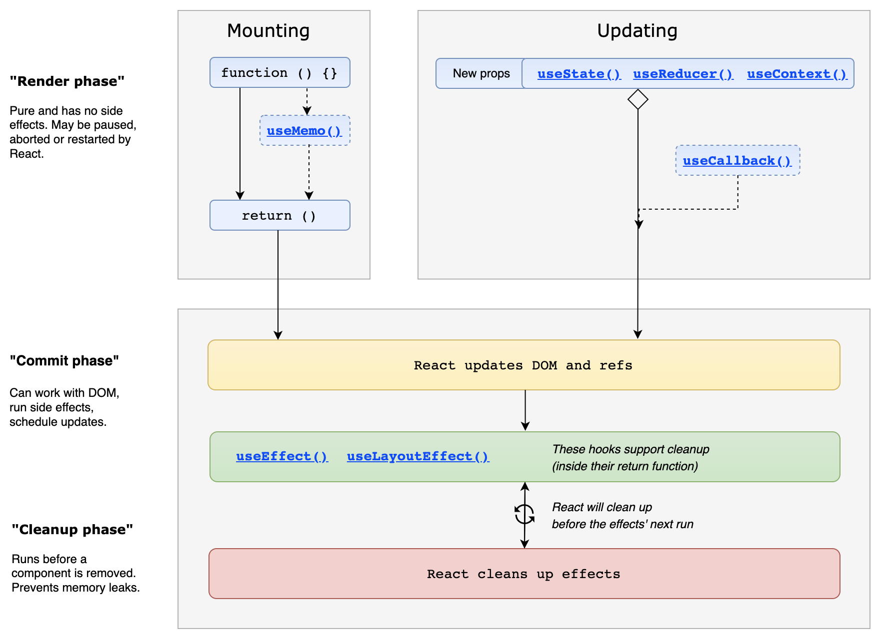

# 生命周期

## 挂载

创建组件实例并插入 DOM。

- **`constructor()`**：构造方法
- `static getDerivedStateFromProps()`
- **`render()`**：渲染函数
- **`componentDidMount()`**：组件创建好并添加到 DOM 后执行

## 更新

组件的 props 或 state 变化会触发更新，重新执行渲染函数，更新 DOM。

- `static getDerivedStateFromProps()`
- `shouldComponentUpdate()`
- **`render()`**：渲染函数
- `getSnapshotBeforeUpdate()`
- **`componentDidUpdate()`**：DOM 更新完成后执行

## 卸载

组件从 DOM 中移除。

- **`componentWillUnmount()`**：组件从 DOM 中移除前执行
