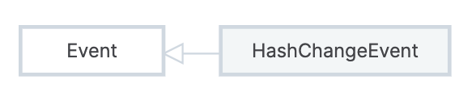

# window.location

`window.location` 是一个 `Location` 对象，用于控制文档的当前 URL。

URL 由以下部分组成：

- `href`：完整 URL
  - `origin`：源
    - `protocol`：协议
    - `host`：主机
      - `hostname`：主机名，域名或 IP
      - `port`：端口
  - `pathname`：路径
  - `search`：query param
  - `hash`：hash ID

|   href   | `https://example.org:8080/foo/bar?q=baz#bang` |
| :------: | :-------------------------------------------: |
|  origin  |          `https://example.org:8080`           |
| protocol |                   `https:`                    |
|   host   |              `example.org:8080`               |
| hostname |                 `example.org`                 |
|   port   |                    `8080`                     |
| pathname |                  `/foo/bar`                   |
|  search  |                   `?q=baz`                    |
|   hash   |                    `#bang`                    |

属性：

- 上面提到的 URL 的每个部分都有对应的属性
- `location = 'xxx'` 等价于 `location.href = 'xxx'`

方法：

- `assign(url)`：导航到另一个 URL
- `reload()`：刷新当前页面，相当于点击浏览器的刷新按钮
- `replace(url)`：用另一个 URL 替换当前页面
- `toString()`：返回 `href` 属性的值

`hashchange` 事件：

- 当页面 `hash` 改变时触发

```js
addEventListener("hashchange", (event) => {});
```



`HashChangeEvent`：

- `newURL`：导航后的新 URL
- `oldURL`：导航前的旧 URL
