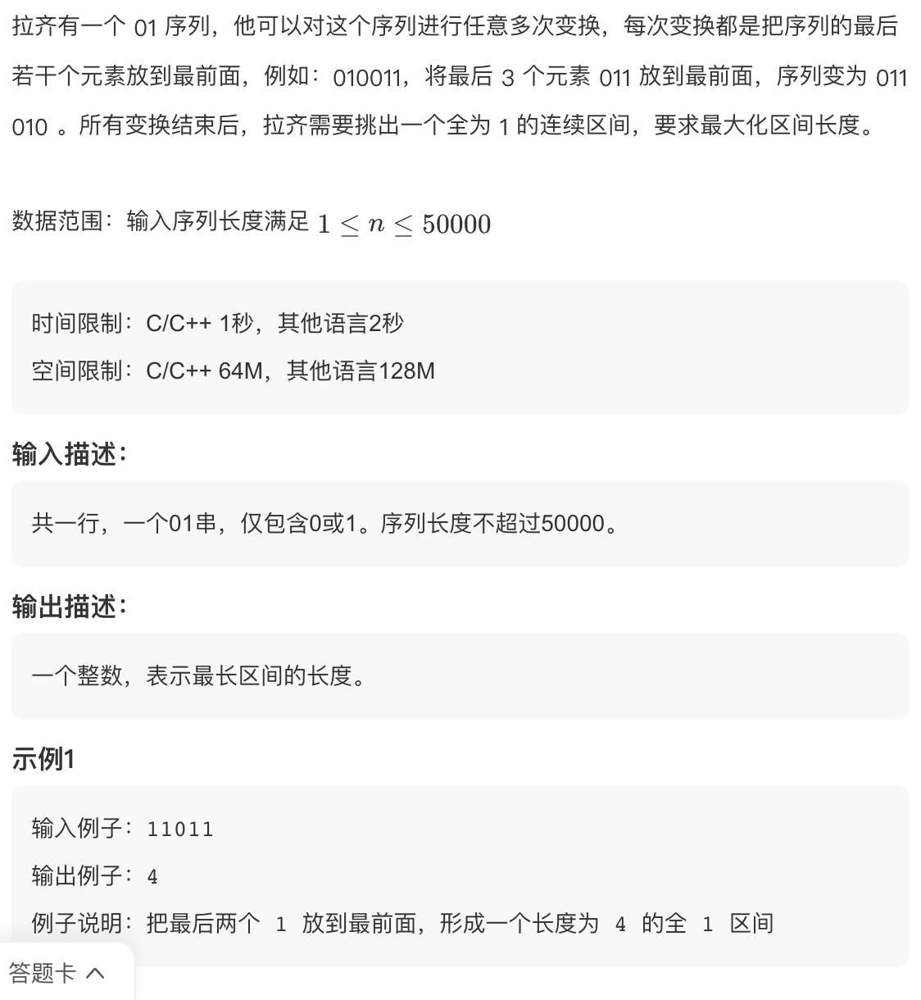
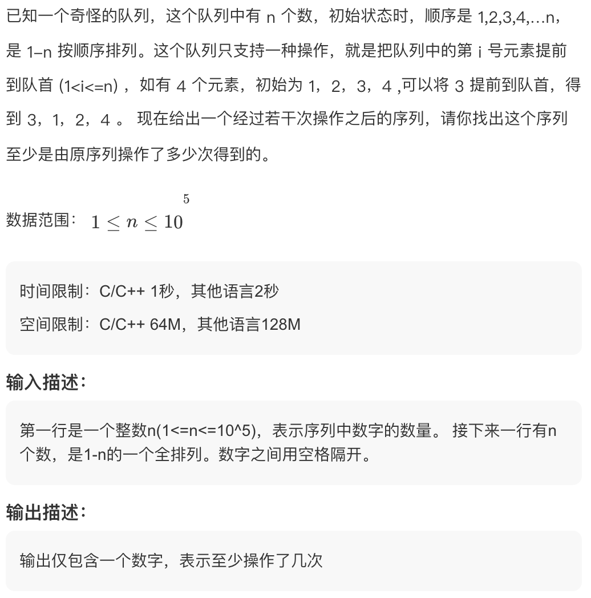
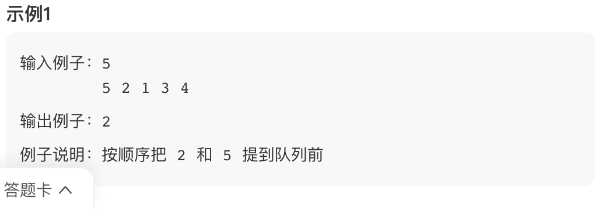

# 京东 2019 春招前端

## 31. 最长区间【模】



```js
function longestAllOneInterval(s) {
  let res = 0;
  const n = s.length;
  let i = 0;
  while (i < n) {
    if (s[i] !== '1') {
      ++i;
      continue;
    }
    let j = (i + 1) % n;
    let cnt = 1;
    while (j !== i && s[j] === '1') {
      j = (j + 1) % n;
      ++cnt;
    }
    res = Math.max(res, cnt);
    if (j <= i) {
      break;
    }
    i = j + 1;
  }
  return res;
}
```

## 32. 队列最小修改【签到】





```js
function minStrangeQueueOperations(nums) {
  const n = nums.length;
  let i = n - 1;
  while (i > 0 && nums[i - 1] < nums[i]) {
    --i;
  }
  return i;
}
```
