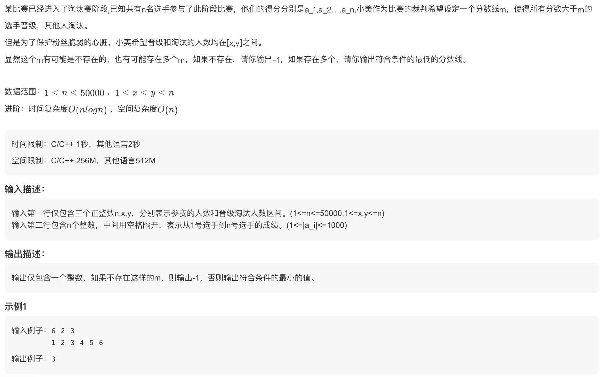
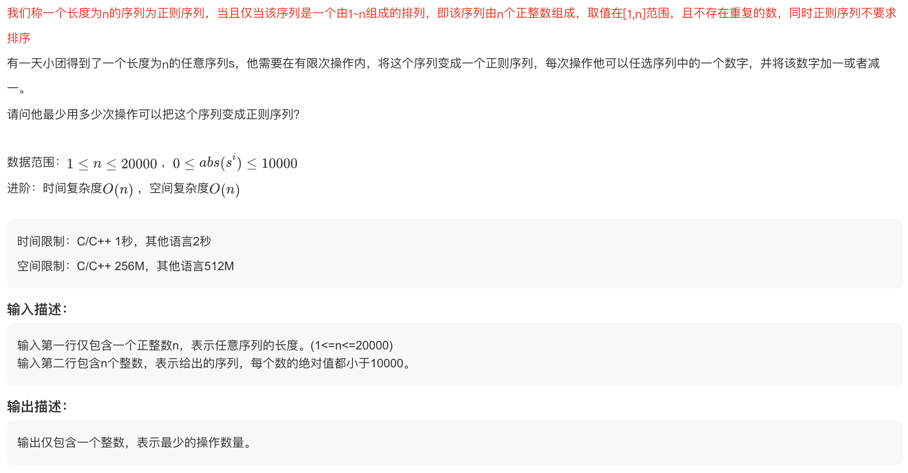
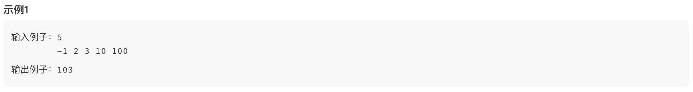
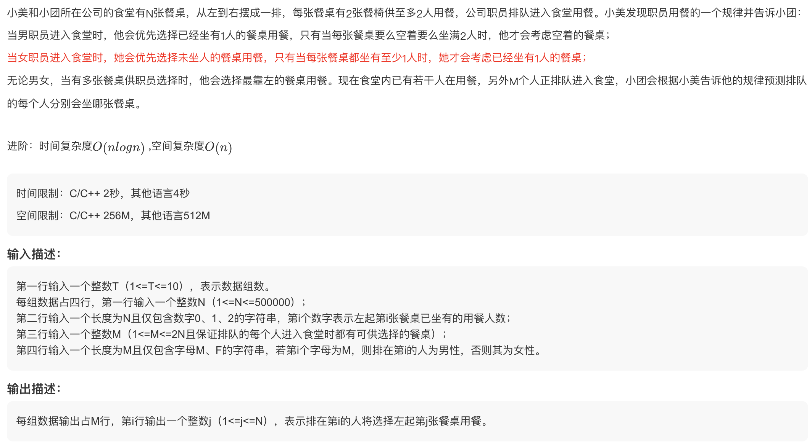
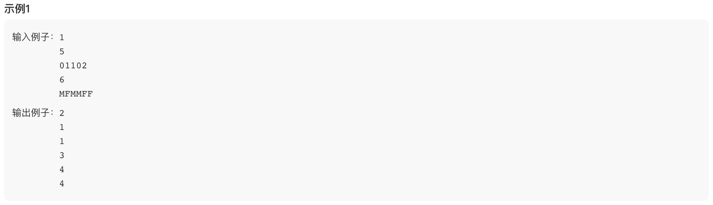
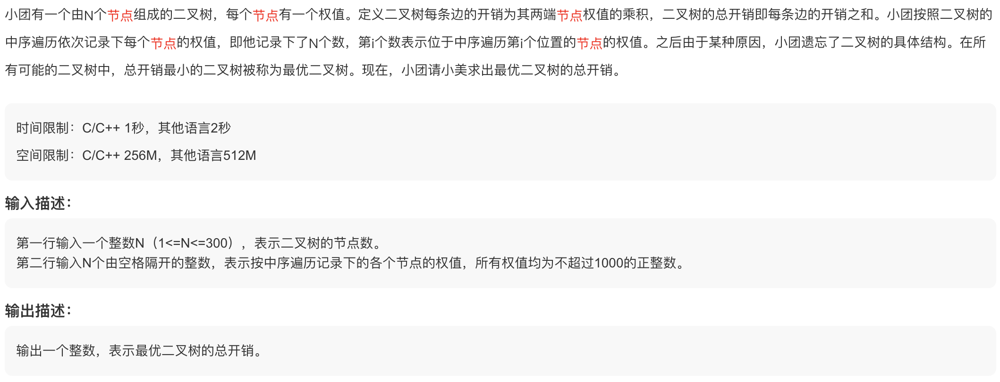
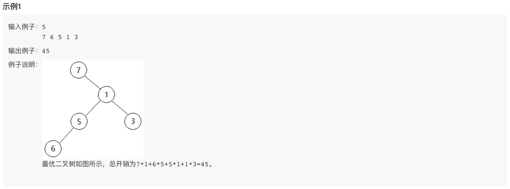

# 美团 2021 校招 (10)

## 1. 淘汰分数【排序】



```js
function getEliminateScore(n, x, y, scores) {
  if (n < 2 * x || n > 2 * y) {
    return -1;
  }
  scores.sort((a, b) => a - b);
  let i = Math.max(x, n - y);
  while (i < n && scores[i - 1] === scores[i]) {
    ++i;
  }
  if (i > y || n - i < x) {
    return -1;
  }
  return scores[i - 1];
}
```

## 2. 正则序列【排序】





```js
function getMinOperationCount(nums) {
  let res = 0;
  nums.sort((a, b) => a - b);
  for (let i = 0; i < nums.length; ++i) {
    res += Math.abs(nums[i] - (i + 1));
  }
  return res;
}
```

## 3. 公司食堂【模拟】





```js
function getSitPositions(tables, people) {
  const res = [];
  const emptyTableQueue = [];
  const onePersonTableQueue = [];
  const newOnePersonTableQueue = [];
  const n = tables.length;
  for (let i = 0; i < n; ++i) {
    if (tables[i] === '0') {
      emptyTableQueue.push(i);
    } else if (tables[i] === '1') {
      onePersonTableQueue.push(i);
    }
  }

  const sitEmptyTable = () => {
    const emptyTable = emptyTableQueue.shift();
    res.push(emptyTable + 1);
    newOnePersonTableQueue.push(emptyTable);
  };

  const sitOnePersonTable = () => {
    const onePersonTable =
      onePersonTableQueue.length &&
      (!newOnePersonTableQueue.length ||
        onePersonTableQueue[0] < newOnePersonTableQueue[0])
        ? onePersonTableQueue.shift()
        : newOnePersonTableQueue.shift();
    res.push(onePersonTable + 1);
  };

  for (const sex of people) {
    if (sex === 'M') {
      if (onePersonTableQueue.length || newOnePersonTableQueue.length) {
        sitOnePersonTable();
      } else {
        sitEmptyTable();
      }
    } else if (sex === 'F') {
      if (emptyTableQueue.length) {
        sitEmptyTable();
      } else {
        sitOnePersonTable();
      }
    }
  }
  return res;
}
```

## 4. 最优二叉树 II【DP】





```js
function getMinBinaryTreeCost(inorder) {
  const n = inorder.length;
  inorder = [0, ...inorder, 0];
  const ldp = new Array(n + 2).fill(0).map(() => new Array(n + 2).fill(0));
  const rdp = new Array(n + 2).fill(0).map(() => new Array(n + 2).fill(0));
  for (let len = 1; len <= n; ++len) {
    for (let i = 1; i + len - 1 <= n; ++i) {
      const j = i + len - 1;
      ldp[i][j] = Infinity;
      rdp[i][j] = Infinity;
      for (let k = i; k <= j; ++k) {
        ldp[i][j] = Math.min(
          ldp[i][j],
          ldp[i][k - 1] + inorder[k] * inorder[j + 1] + rdp[k + 1][j]
        );
        rdp[i][j] = Math.min(
          rdp[i][j],
          ldp[i][k - 1] + inorder[k] * inorder[i - 1] + rdp[k + 1][j]
        );
      }
    }
  }
  return ldp[1][n];
}
```
