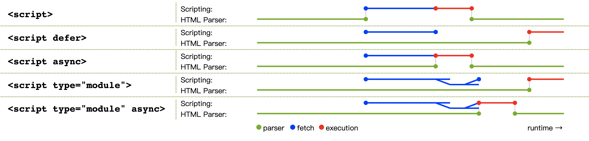

# 常用元素

## HTML 文档

```html
<html>
  <head>
    <title>页面标题</title>
    <link rel="stylesheet" href="https://example.com" />
    <style>
      /* 嵌入样式 */
    </style>
  </head>
  <body>
    <!-- 页面内容 -->
  </body>
</html>
```

## JS 脚本

```html
<!-- 同步加载，立即执行 -->
<script src="https://example.com"></script>
<!-- 异步加载，最后执行 -->
<script src="https://example.com" defer></script>
<!-- 异步加载，立即执行 -->
<script src="https://example.com" async></script>
<!-- 异步加载，最后执行 -->
<script src="https://example.com" type="module"></script>
<!-- 异步加载，立即执行 -->
<script src="https://example.com" type="module" async></script>
```



| 类型                           | 加载 | 执行 |
| ------------------------------ | ---- | ---- |
| `<script>`                     | 同步 | 立即 |
| `<script defer>`               | 异步 | 最后 |
| `<script async>`               | 异步 | 立即 |
| `<script type="module">`       | 异步 | 最后 |
| `<script type="module" async>` | 异步 | 立即 |

## 布局

```html
<div id="xxx" class="xxx" style="xxx">
  <!-- 子元素 -->
</div>
```

## 文本

```html
<h1>一级标题</h1>
<h2>二级标题</h2>
<h3>三级标题</h3>
<h4>四级标题</h4>
<h5>五级标题</h5>
<h6>六级标题</h6>
<p>段落</p>
<span>行内文本</span>
<a href="https://example.com" target="_blank">链接</a>
```

## 多媒体

```html

```

## 表格

```html
<table>
  <thead>
    <tr>
      <th></th>
    </tr>
  </thead>
  <tbody>
    <tr>
      <td></td>
    </tr>
  </tbody>
  <tfoot>
    <tr>
      <td></td>
    </tr>
  </tfoot>
</table>
```

## 表单

```html
<form action="/" method="post">
  <label for="username">用户名</label>
  <input type="text" id="username" name="username" required />
  <input type="email" name="email" />
  <input type="password" name="password" required />
  <textarea name="bio" rows="5" cols="15"></textarea>
  <input type="radio" name="gender" value="male" checked />
  <input type="radio" name="gender" value="female" />
  <input type="checkbox" name="confirm" />
  <select name="conutry">
    <option value="cn">中国</option>
    <option value="us">美国</option>
    <option value="uk">英国</option>
  </select>
  <input type="submit" value="提交" />
  <button type="submit">提交</button>
</form>
```
