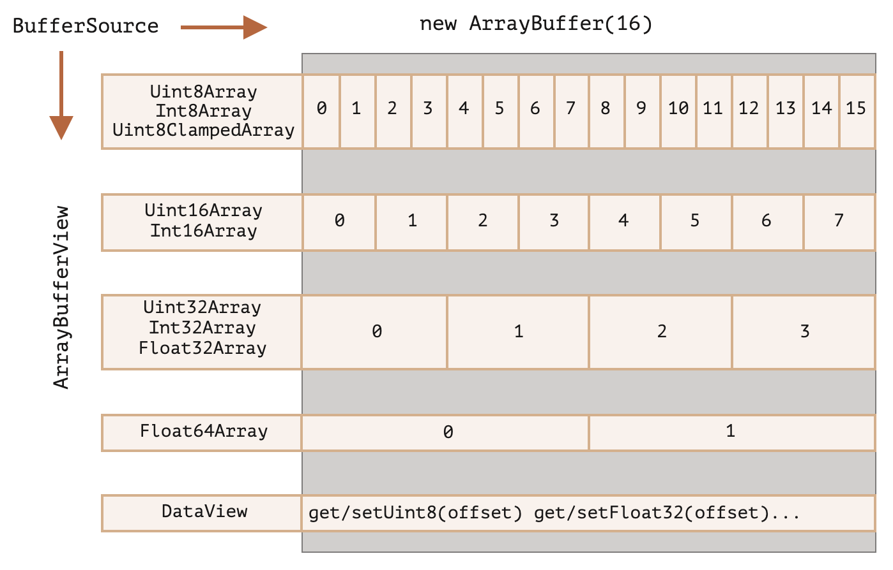

# ArrayBuffer

`ArrayBuffer` 是一种二进制对象，引用固定长度的连续内存空间。

创建 `ArrayBuffer`：

```js
// byteLength 字节，用 0 填充
new ArrayBuffer(byteLength);
```

`ArrayBuffer` 无法直接访问，需要通过视图对象进行操作。

有 2 类视图对象：

- `TypedArray`：将字节解释为不同类型的数组，包含若干类型
  - 不存在 `TypedArray` 构造函数，只是一个概念上的统称
- `DataView`：
  - `TypedArray` 只能将整个 `ArrayBuffer` 解释为一种类型
  - `DataView` 支持将 `ArrayBuffer` 的不同部分解释为不同的类型


