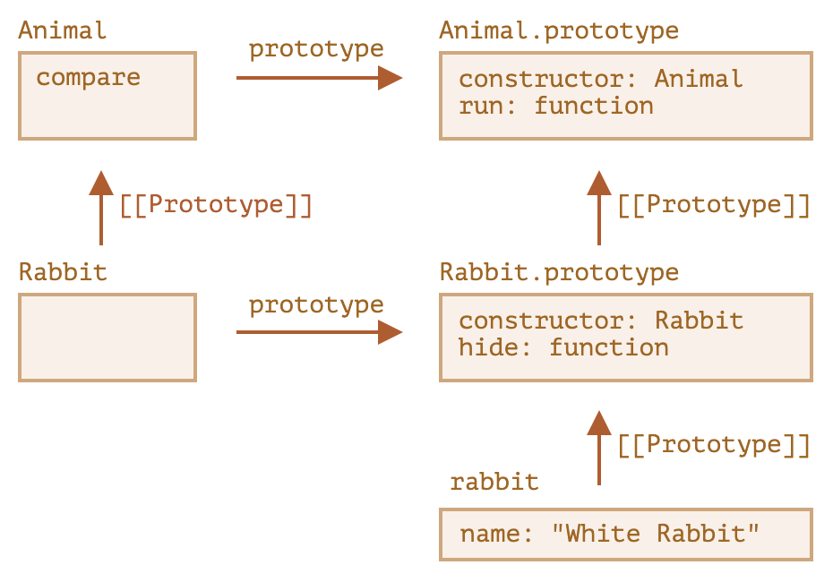

# class

ES6 引入的创建自定义类型的方式。

- 可以代替原来的构造函数
- 更符合 OOP 的书写习惯

```js
class MyClass extends SuperClass {
  // 属性
  prop1 = value1;

  // 构造方法
  constructor() {}

  // 访问器属性
  get prop2() {}
  set prop2(newVal) {}

  // 实例方法
  method1() {}

  // 静态属性
  static staticProp = value;

  // 静态方法
  static staticMethod() {}
}

const myInstance = new MyClass();
```

## 原理

- 创建一个名为 `MyClass` 的构造函数，参数和函数体来自 `constructor`
- 在函数体内把属性设置到 `this` 上，比如 `prop1`
- 把访问器属性和实例方法设置在原型对象 `MyClass.prototype` 上，比如 `prop2`、`method1`

```js
typeof class {};
// function
```

## 与构造函数的区别

- 内部属性 `[[IsClassConstructor]]` 的值为 `true`
  - JS 会在很多地方用到这个属性，来区分 `class` 和构造函数
    - 必须使用 `new` 调用，直接调用会报错
    - `toString()` 的输出以 `class` 开头，而不是 `function`
- 位于原型上的方法不可枚举
  - `enumerable: false`
- 总是处于严格模式

## 箭头函数属性

由于箭头函数的 `this` 会绑定为外层的 `this`，使用箭头函数属性代替函数声明可以将函数的 `this` 绑定为创建的对象本身，无论函数被传递到什么地方调用。

箭头函数属性会作为自有属性在每个对象上都有一份拷贝。

## 继承

使用 `extends` 声明继承，只支持单继承。

```js
class Rabbit extends Animal {}
```

原理：

- 把 `Rabbit.prototype.[[Prototype]]` 设置为 `Animal.prototype`
- 把 `Rabbit.[[Prototype]]` 设置为 `Animal`



- **必须**在子类 constructor 中使用 `super()` 调用父类 constructor
  - 在 `this` 的访问之前
  - 为了实现父类实例属性的继承 (非原型属性)
  - 使用 `new` 执行子类 constructor 时，不会创建空对象并赋值给 `this`，而是期望父类 constructor 完成这项工作
- 可以在子类方法中使用 `super.method()` 调用父类方法
- `super` 使用内部属性 `[[HomeObject]]` 实现，值为函数声明时所在的对象
- 箭头函数没有自己的 `super`，与声明时外部环境的 `super` 相同

默认生成的 constructor：

```js
class Rabbit extends Animal {
  constructor(...args) {
    super(...args);
  }
}
```
