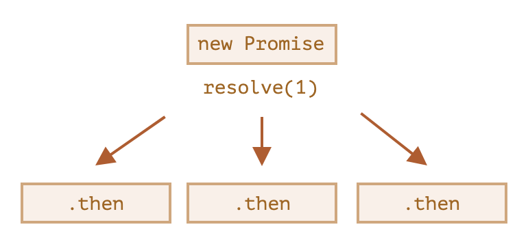
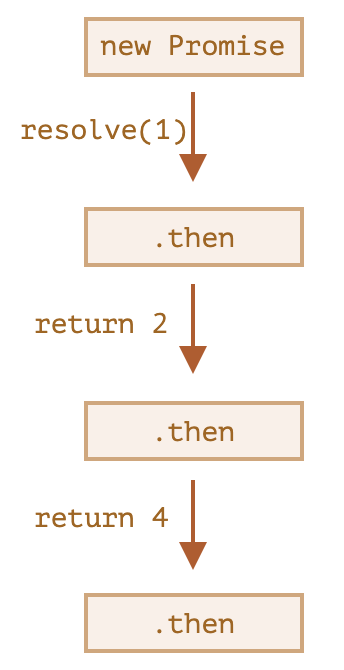

# Promise

## 回调地狱

串联多个异步执行的结果需要编写嵌套的回调函数，嵌套层数过多导致代码的可读性和可维护性都很差，称为回调地狱 (callback hell)。

```js
loadScript('/script.js', script => {
  loadScript('/script2.js', script => {
    loadScript('/script3.js', script => {
      // ...加载完所有脚本后继续
    });
  });
});
```

## Promise

ES6 引入的 `Promise` 支持以非嵌套方式编写异步执行链。

创建 Promise 时传入一个函数，在函数体内编写异步代码：

```js
const promise = new Promise((resolve, reject) => {
  // 异步执行的代码，也可以是同步代码
});
```

函数接收 2 个参数，都是函数类型：

- `resolve(value)`：执行成功的回调函数，`value` 表示执行结果
- `reject(error)`：执行出错的回调函数，`error` 表示错误对象

## 状态流转

Promise 对象有 2 个内部属性：

- `state`：状态
  - `pending`：执行中（初始值）
  - `fulfilled`：执行完成
  - `rejected`：执行失败
- `result`：结果
  - `undefined`：无结果（初始值）
  - `value`：执行结果
  - `error`：执行错误对象


如果函数内即没有调用 `resolve` 也没有调用 `reject`，promise 就会一直处于 `pending` 状态。

## then

`then` 指定 `resolve` 和 `reject` 后的回调函数：

```js
promise.then(
  result => {
    // resolve 回调
  },
  error => {
    // reject 回调
  }
);
```

可以在一个 promise 上多次调用 `then`，操作彼此独立，无先后顺序：



## catch

`catch` 是 `then(undefined, errorHandler)` 的简写，用于错误处理。

```js
promise.catch(error => {
  // reject 回调
});
```

错误来源有 2 个：

- `reject`
- `throw`：`throw error` 相当于 `reject(error)`

处理流程：

- 错误发生后，跳转到最近的 `catch`
- 如果当前 `catch` 处理不了这个错误，可以重新 `throw` 这个错误，将转移给下一个最近的 `catch`
- 如果当前 `catch` 没有 `throw` 新的错误，则错误不会向下传递，下方的 `then` 正常调用 (但没有结果值)
- 没有被 `catch` 捕获的错误会中止脚本的执行，在控制台报错

```js
new Promise((resolve, reject) => {
  throw new Error('Whoops!');
})
  .catch(error => {
    alert('The error is handled, continue normally');
  })
  .then(() => alert('Next successful handler runs'));
```

## finally

promise resolve 或 reject 后都会执行 `finally`。

```js
promise.finally(() => {
  // resolve 或 reject 后都会触发
});
```

## Promise 链

`then` 的返回值会被包装成一个新的 promise，因此可以链式地调用 `then`，实现异步代码的串行处理。

```js
new Promise(function (resolve, reject) {
  setTimeout(() => resolve(1), 1000);
})
  .then(function (result) {
    alert(result); // 1
    return result * 2;
  })
  .then(function (result) {
    alert(result); // 2
    return result * 2;
  })
  .then(function (result) {
    alert(result); // 4
    return result * 2;
  });
```



## async

`async` 用于装饰一个函数，表示这个函数始终返回一个 promise，函数返回的非 promise 值会被包装成 resolve 后的 promise。

## await

`await` 用于等待 promise 出结果 (settle)，只能用于 `async` 函数中或模块顶层。

```js
async function asyncFunc() {
  const promise = new Promise((resolve, reject) => {
    setTimeout(() => resolve('done!'), 1000);
  });
  let result = await promise; // 等待直到 promise resolve
  alert(result); // 1 秒后弹出 "done!"
}
```

本质是把 `await` 后面的代码作为 `then` 的回调。

如果 promise 被 reject，`await` 会 throw 相应的 error，可以用 `try...catch` 捕获。

```js
async function f() {
  try {
    let response = await fetch('http://no-such-url');
  } catch (err) {
    alert(err); // TypeError: failed to fetch
  }
}
```
