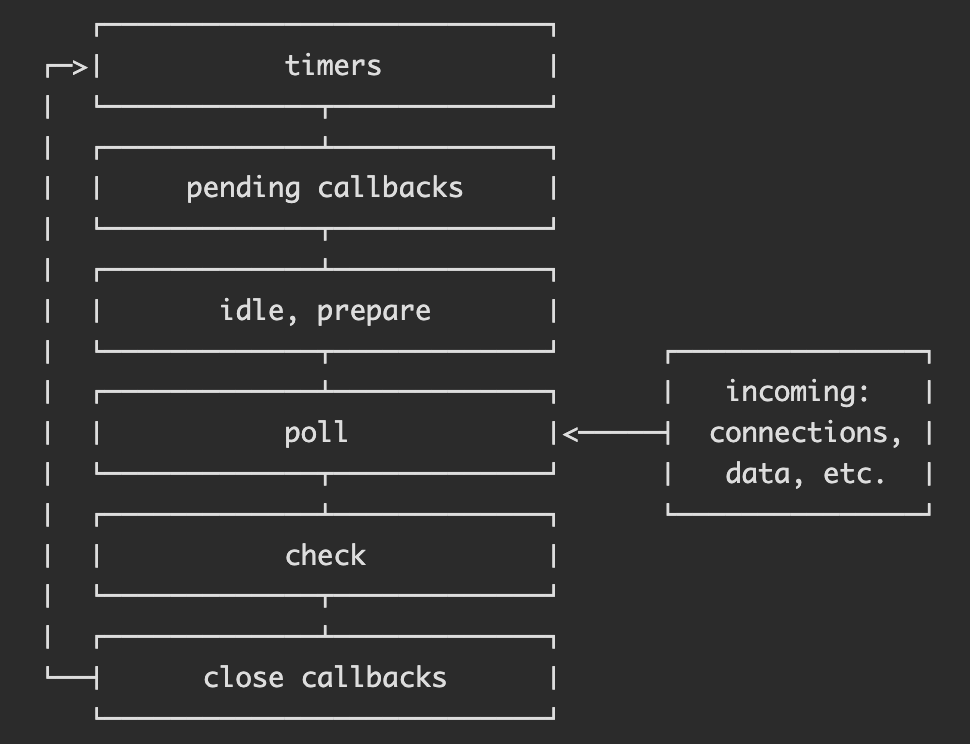

# Node 事件循环

Node 事件循环有以下 6 个阶段 (phase)：

1. **timers**
   - `setTimeout`
   - `setInterval`
2. **pending callbacks**
   - 推迟到下次循环的 I/O 回调
   - 比如 TCP 错误 `ECONNREFUSED`
3. **idle, prepare**
   - Node 内部使用
4. **poll**
   - 其他所有 I/O 回调
5. **check**
   - `setImmediate`
   - 用于在 `poll` 阶段之后执行回调
6. **close callbacks**
   - 关闭回调
   - 比如 `socket.on('close', ...)`



## poll

`poll` 阶段的 2 个主要功能：

1. 计算本次轮询的时间限制
2. 执行 `poll queue` 里的回调

处理流程：

1.  `poll queue` 非空
    1. 依次、同步执行队列里的回调，直到队列为空或达到时间限制
2.  `poll queue` 为空
    1. 有 `setImmediate` 回调
       1. 结束 `poll` 阶段，进入 `check` 阶段
    2. 无 `setImmediate` 回调
       1. 阻塞等待，直到队列不为空并执行回调或达到时间限制

一旦 `poll queue` 为空，Node 就会检查是否有 timer 时间到了，如果有，就退出 `poll` 阶段。

## setImmediate

执行顺序不确定

```js
// timeout_vs_immediate.js
setTimeout(() => {
  console.log('timeout');
}, 0);

setImmediate(() => {
  console.log('immediate');
});
```

```
$ node timeout_vs_immediate.js
timeout
immediate

$ node timeout_vs_immediate.js
immediate
timeout
```

总是先执行 `setImmediate`

```js
// timeout_vs_immediate.js
const fs = require('fs');

fs.readFile(__filename, () => {
  setTimeout(() => {
    console.log('timeout');
  }, 0);
  setImmediate(() => {
    console.log('immediate');
  });
});
```

```
$ node timeout_vs_immediate.js
immediate
timeout

$ node timeout_vs_immediate.js
immediate
timeout
```

## process.nextTick

`process.nextTick` 注册的回调将会在当前操作完成**后**、事件循环进入下一个阶段**前**立即执行，不管位于哪个阶段。

有可能阻塞事件循环，比如在其他阶段 `nextTickQueue` 的回调过多，导致迟迟不能进入 `poll` 阶段。

真实案例：

```js
const server = net.createServer(() => {});
server.on('connection', conn => {});
server.listen(8080);
server.on('listening', () => {});
```

- `.listen(8080)` 会立即完成并触发 `listening` 事件，引发一些不符合预期的行为
  - `listening` 的事件处理函数还没有注册，导致无法触发回调
  - 有可能马上建立连接并触发 `connection` 事件并执行回调，早于 `listening` 的回调
- 事件通过 `process.nextTick` 注册，使所有事件处理函数注册完之后再执行事件回调

总结：

- 推荐开发者使用 `setImmediate` 而不是 `process.nextTick`，因为前者更简单。
- `process.nextTick` 主要用于在事件循环继续之前执行一些操作，比如处理错误、清理资源。
