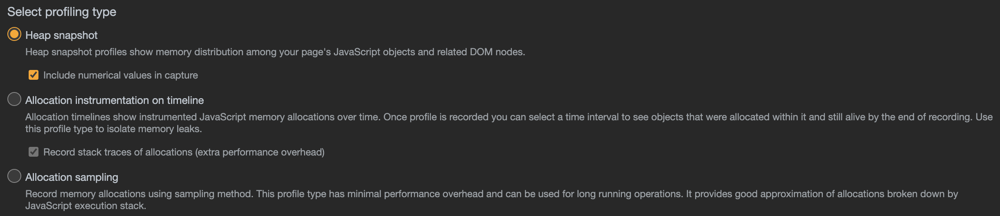

# Chrome DevTools

| 调试面板    | 功能                                 |
| ----------- | ------------------------------------ |
| Elements    | DOM 相关信息                         |
| Console     | 打印信息、执行语句                   |
| Sources     | 查看源码                             |
| Network     | 网络请求                             |
| Performance | 耗时信息                             |
| Memory      | 内存使用信息                         |
| Application | 应用信息，基本信息、存储、后台服务等 |
| Lighthouse  | 性能、体验指标                       |

## Memory

分析 (profile) 内存使用和分配情况，有三种分析类型：

- 堆快照
- 内存分配时间线
- 内存分配采样

